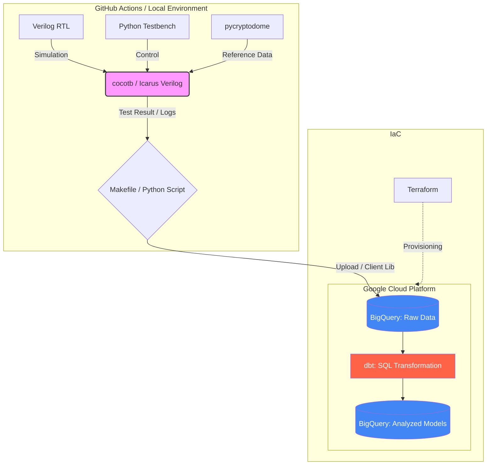

# 1.はじめに
本記事では、共通鍵暗号方式のデファクトスタンダードである「AES-128」を題材に、Verilog HDL によるハードウェアモデルと、Python によるソフトウェアライブラリを組み合わせた「協調検証環境」の構築について解説します。
具体的には、検証フレームワーク **cocotb** を介してPythonからハードウェアモデルを制御・テストし、出力された膨大な検証結果を **BigQuery** へ集約。さらに **dbt** を用いて動作確認や入力パターンの詳細な解析を行いました。
本内容は、先に公開した記事『AES-128 設計を GitHub Actions で自動化：BigQueryとdbtを使用したデータ解析』で構築したパイプラインを、より深掘りするために作成しました。


| ◆構成 |
|:---------------|
|[1.はじめに](#1はじめに) |
|[2.技術スタックとシステム構成](#2技術スタックとシステム構成)|
|[3.cocotbによる検証とデータ収集](#3cocotbによる検証とデータ収集)|
|[4.dbtによる分析](#4dbtによる分析)|
|[5.実行方法](#5実行方法)|
|[6.実行結果](#6実行結果)|
|[7.まとめ](#7まとめ)|


# 2.技術スタックとシステム構成

## 2-1.技術スタック
本環境では、ハードウェア検証の結果をクラウドへシームレスに転送し、分析するために以下のツールを組み合わせています。

|カテゴリ|技術・ツール|用途|
|:--- |:--- |:--- |
|Hardware|Verilog HDL/Icarus Verilog|回路記述・シミュレーション|
|Software|Python 3.11|期待値生成・比較検証スクリプト
|Data Analysis|BigQuery/dbt|検証ログの蓄積・分析モデルの構築
|Infrastructure|Docker/Docker Compose|ツールチェーンのコンテナ化|
|IaC|Terraform|検証用環境のプロビジョニング（拡張用）|
|Management|Makefile|ビルド・テストコマンドの共通化|

### 2-1-1. ライブラリ (Python)

| ライブラリ | 説明 |
| :--- | :--- |
| cocotb | Python で記述できる、ハードウェア記述言語（VHDL/Verilog）向けのコ・シミュレーション検証フレームワーク |
| pycryptodome | 暗号化、復号、ハッシュ計算など、低レベルな暗号機能を幅広く提供する Python 自律型暗号ライブラリ |
| google-cloud-bigquery | BigQuery へのデータの読み書き、クエリ実行を行うための Google Cloud 公式クライアントライブラリ |
| dbt-bigquery | データ変換ワークフローツール「dbt」を BigQuery で動作させるための専用アダプターライブラリ |


## 2-2. ディレクトリ構成
本プロジェクトの全体構成は以下の通りです。ソースコードはすべて GitHub リポジトリ に公開しています。

https://github.com/wata123-t/AES-128_GitHub_Actions

```text
.
├── .github/workflows/   # CI/CD設定（GitHub Actions）
├── aes_dbt/             # BigQuery上のデータ変換・管理（dbtプロジェクト）
├── python/              # cocotbテストベンチ・期待値生成スクリプト
├── terraform/           # Google Cloud インフラ定義（IaC）
├── verilog/             # AES-128 暗号化回路（RTL設計データ）
├── Dockerfile           # 検証ツール（Icarus Verilog/Python）の環境定義
├── docker-compose.yaml  # 複数コンテナ・環境変数の管理
├── Makefile             # 各種実行コマンドの共通化
└── README.md            # プロジェクトの概要・セットアップ手順


```

## 2-3. システム構成
システム構成と簡易フローを図示します。（詳細は後述のセクションを参照）




# 3.cocotbによる検証とデータ収集
ここでは、Pythonベースの検証フレームワーク cocotb を使い、回路のシミュレーションと同時に検証結果をクラウドへ送信する仕組みを解説します。

## 3-1. 検証の仕組み
Pythonから直接Verilogを操作しているように見えますが、その裏側ではC++が高度な仲介を行っています。
協調検証環境では、以下の3つの要素が **「バトンを渡すように」細かく切り替わりながら動作** しています。
この制御をcocotbが肩代わりする事で、ユーザーはシミュレータ特有の複雑なコマンドやC言語インターフェース(VPI/DPI)を意識せず、使い慣れたPythonでの検証に集中できます。

|レイヤー|役割|備考|
| :--- | :--- |:--- |
|Python(cocotb)|テストシナリオの記述|`async`/`await`による柔軟な制御|
|C++中間層(GPI)|命令の変換・仲介|PythonとC言語の世界を接続|
|Icarus Verilog|回路の動作実行|VPI/DPIという標準規格でC++と通信|


## 3-2. 検証シナリオ
具体的なテストの流れを解説します、大きな特徴としては、以下の二点になります。

**1. PyCryptodomeの活用**
Pythonの標準的な暗号ライブラリを用いて「正解(期待値)」を算出します。

**2. 疑似エラーの注入 (inject_error)**
あえて10%の確率で入力を改ざんし、後続の分析基盤（dbt等）で「不一致」を正しく検知できるか、パイプラインの健全性をテストする試験となります。


<details>
<summary>コード(python/test_aes.py)のテストシナリオ部を抜粋</summary>

```python
#####################################################
# テストシナリオ
#####################################################
@cocotb.test()
async def aes_basic_test(dut):
    # 1. バックグラウンドでクロック生成を開始 (10ns周期 = 100MHz)
    cocotb.start_soon(Clock(dut.clk, 10, units="ns").start())

    # 2. ハードウェアのリセット処理
    # Pythonを20ns停止(await)させて、その間のRTL動作を待機する
    dut.rst.value = 1
    dut.start.value = 0
    await Timer(20, units="ns")
    dut.rst.value = 0
    await RisingEdge(dut.clk)

    results = [] 
    test_count = 50 
    run_timestamp = datetime.datetime.now().strftime("%Y%m%d%H%M%S")

    # 3. 検証ループ（指定回数分、ランダム・テストを実施）
    for i in range(test_count):
        # 3-1. データ生成
        ptext_int = random.getrandbits(128)
        key_int = random.getrandbits(128)

        # 3-2. 疑似エラーの挿入（10%の確率でVerilogへの入力だけ壊す）
        inject_error = True if random.random() < 0.1 else False
        sim_input = ptext_int ^ 1 if inject_error else ptext_int

        # 3-3. RTLへの信号入力とシミュレーション実行
        dut.plaintext.value = sim_input # 壊れた可能性のある値を入力
        dut.key.value = key_int
        dut.start.value = 1
        await RisingEdge(dut.clk)
        dut.start.value = 0

        # 3-4. 処理完了待ち
        # 完了信号(done)が立つまで Python を一時停止して待機
        count = 0
        while not dut.done.value and count < 100:
            await RisingEdge(dut.clk)
            count += 1

        actual_out = int(dut.ciphertext.value)
        
        # 3-5. 期待値の算出
        cipher = AES.new(key_int.to_bytes(16, 'big'), AES.MODE_ECB)
        expected_out = int.from_bytes(cipher.encrypt(ptext_int.to_bytes(16, 'big')), 'big')

        # 3-6. BigQuery送信用データ成績（128bitを0埋め16進数文字列にする）
        res_data = {
            "test_id": f"{run_timestamp}_{i}",
            "ptext_hex": format(ptext_int, '032x'),
            "key_hex": format(key_int, '032x'),
            "actual_out_hex": format(actual_out, '032x'),
            "expected_out_hex": format(expected_out, '032x'),
            "error_injected": inject_error,
            "timestamp": datetime.datetime.now().isoformat()
        }

        # 3-7. データ追加
        results.append(res_data)

    # 4. BigQueryに送信
    if results:
        send_to_bigquery_batch(results)

```
</details>


## 3-3. BigQueryへのバッチロード
シミュレーションで収集した検証結果を、一括してBigQueryへ転送します。
1レコードずつ送信するのではなく、リストに蓄積してから **「バッチロード」** することで、APIの呼び出し回数を抑え、高速かつ効率的にクラウドへデータを同期します。

`bigquery.Client`設定は、「ローカル環境での実施時」、「GitHub ActionSでの実施」で切り替えが必要となります。

<details>
<summary>コード(python/test_aes.py)のBigQueryバッチロード部を抜粋</summary>

```python

def send_to_bigquery_batch(results):
    """
    検証結果リストをJSON形式でBigQueryへ一括ロードする
    """

    ★以下の二つは必ず、どちらか一方を選択してから実行してください
    #################################################################################
    #　①ローカル環境での実行用
    #################################################################################
    key_path = os.path.join(os.path.dirname(__file__), "credentials/bq-writer.json")
    credentials = service_account.Credentials.from_service_account_file(key_path)
    client = bigquery.Client(credentials=credentials, project=credentials.project_id)
    table_id = f"{credentials.project_id}.aes_verification_dataset.verification_results"

    #################################################################################
    # ②GitHub Action　で実施する場合
    #################################################################################
    client = bigquery.Client(location="asia-northeast1")
    table_id = f"{client.project}.aes_verification_dataset.verification_results"
    #################################################################################
    

    # --- ロードジョブの設定 ---
    job_config = bigquery.LoadJobConfig(
        # JSON (LJSON) 形式でロード
        source_format=bigquery.SourceFormat.NEWLINE_DELIMITED_JSON,
        # データの型を自動判別
        autodetect=True,
        # 実行のたびにテーブルを上書き (履歴を蓄積する場合は WRITE_APPEND を使用)
        write_disposition="WRITE_TRUNCATE", 
    )

    # --- データの転送実行 ---
    # Python のリスト(dict)を直接 JSON としてロードジョブに投入
    job = client.load_table_from_json(results, table_id, job_config=job_config)
    
    try:
        # ジョブの完了を待機
        job.result()
        print(f"Success: {job.output_rows} rows loaded to BigQuery (Table Overwritten).")
    except Exception as e:
        # 転送失敗時のエラーハンドリング
        print(f"Failed to load data: {e}")


```
</details>


# 4.dbtによる分析
BigQueryに蓄積されたシミュレーション結果を、dbtを用いて解析・分類しました。

## 4-1. 期待値比較(aes_summary.sql)
単なる期待値との照合だけでなく、「意図的にエラーを注入したシナリオ」を含めることで、テストベンチ自体の検知能力（健全性）を管理しています。

**EXPECTED_FAILURE:** エラー注入に対し、正しく不一致（テスト環境の正常動作）
**PASS:** エラー注入なしの状態で、計算結果が期待値と完全一致
**FAIL:** 想定外の不一致。(修正すべきバグ)

<details>
<summary>コード(./models/aes_summary.sql)</summary>

```sql
SELECT
    test_id,
    timestamp,
    error_injected,
    -- データ型の不一致を防ぐため、文字列として比較
    (actual_out_hex = expected_out_hex) AS is_physically_match,
    
    CASE 
        WHEN error_injected = TRUE AND (actual_out_hex != expected_out_hex) THEN 'EXPECTED_FAILURE'
        WHEN error_injected = FALSE AND (actual_out_hex = expected_out_hex) THEN 'PASS'
        ELSE 'FAIL'
    END AS verification_status
FROM {{ source('aes_raw', 'verification_results') }}
```
</details>


## 4-2. 網羅性観測「ビットトグル分析」 (fct_bit_toggles.sql)
ハードウェア検証において、信号が「0」から「1」、あるいは「1」から「0」へ変化したことを確認する「トグルカバレッジ」は、テストの質を担保する上で不可欠な指標です。
全ビットがどれくらいでの頻度で反転（トグル）するかをチェックるする事でテストパターンの偏りや、特定のビットが固定化の危険性を洗い出します。


```sql

-- models/fct_bit_toggles.sql
{{ config(materialized='table') }}

WITH raw_data AS (
    SELECT 
        test_id,
        timestamp,
        ptext_hex
    FROM {{ source('aes_raw', 'verification_results') }}
),

-- 0〜127のインデックスを生成
bit_indices AS (
    SELECT i AS bit_index FROM UNNEST(GENERATE_ARRAY(0, 127)) AS i
),

-- 1行を128行のビット単位に展開
expanded_bits AS (
    SELECT
        r.test_id,
        r.timestamp,
        b.bit_index,
        -- 1文字(4bit)を取り出し、数値化してビット判定。これなら絶対オーバーフローしません。
        CASE WHEN (
          CAST(CONCAT('0x', SUBSTR(r.ptext_hex, DIV(b.bit_index, 4) + 1, 1)) AS INT64) & 
          (8 >> MOD(b.bit_index, 4))
        ) > 0 THEN 1 ELSE 0 END AS bit_value
    FROM raw_data r
    CROSS JOIN bit_indices b
),

-- ウィンドウ関数で「前回値」と比較
bit_changes AS (
    SELECT
        bit_index,
        bit_value,
        LAG(bit_value) OVER(PARTITION BY bit_index ORDER BY timestamp) AS prev_bit_value
    FROM expanded_bits
)

-- ビットごとのトグル回数を集計
SELECT
    bit_index,
    SUM(CASE WHEN prev_bit_value IS NOT NULL AND bit_value != prev_bit_value THEN 1 ELSE 0 END) AS toggle_count
FROM bit_changes
GROUP BY bit_index

```
<details>
<summary>コード(./models/fct_bit_toggles.sql)</summary>
</details>

### <ins>_◆技術的特徴_</ins>

**1. 長大なビット幅への対応（オーバーフロー回避）**
128bitデータは、通常のSQLの整数型（INT64等）では扱いきれず、そのまま数値化すると桁あふれが発生しますが、このコードでは、SUBSTR を使って16進数文字列を1文字（4bit分）ずつ取り出して処理する事で回避してます。

**2. CROSS JOIN による宣言的なデータ展開**
ループ処理を用いることなく、CROSS JOIN によって1行のレコードを128行の「ビット単位レコード」へとフラット化しています。これにより、SQLの強力な並列分散処理能力をフルに活用できます。

**3. ウィンドウ関数による「動き」の検知**
LAG() 関数を利用し、時系列における「現在の値」と「直前の値」を比較しています。単に「0と1が出現したか」だけでなく、「値が変化した瞬間」をカウントできるため、より動的な網羅性の検証が可能です。

**4. 検証結果の「見える化」への適合性**
出力がビットインデックスごとの集計値となるため、BIツール等でヒートマップ化するのに最適です。「下位ビットは激しく動いているが、上位ビットが全く動いていない」といったテストシナリオの不備を直感的に特定できるようになります。


## 4-3. dbt test による自動品質チェック
モデルを作成して可視化するだけでなく、検証の合格基準や網羅性の閾値を `dbt test`として定義することで、CI/CDパイプライン上で検証の成否を自動判定させることが可能になります。

ここでは、ハードウェア検証において特に重要な2つのチェックを紹介します。


>#### ① トグルカバレッジの自動監視
算出したビットごとのトグル回数から一度も値が変化しなかったビットを即座に検知します。これにより、テストパターンの不足を自動でキャッチできます。

<details>
<summary>コード(./tests/assert_all_bits_toggled.sql)</summary>

```sql
-- 全ビットが1回以上トグルしていないレコードがあれば「失敗」とみなす
SELECT
    bit_index,
    toggle_count
FROM {{ ref('fct_bit_toggles') }}
WHERE toggle_count = 0
SELECT
    bit_index,
    toggle_count
FROM {{ ref('fct_bit_toggles') }}
WHERE toggle_count = 0

```
</details>

>#### ② 検証ステータスの不一致検知
テストベンチの実行結果において、FAIL判定結果が1件も存在しないかをチェックします。
これを `dbt test` に組み込むことで、自動的に品質チェックが走り、見落としを防ぎます。

<details>
<summary>コード(./tests/assert_no_verification_failures.sql)</summary>

```sql
-- verification_status が 'FAIL' のレコードを抽出
-- 1件でもヒットすれば、dbt test は「失敗」と判定します
SELECT
    test_id,
    verification_status
FROM {{ ref('aes_summary') }}
WHERE verification_status = 'FAIL'

```
</details>

:::note info
**なぜSQLだけでなくdbtを使うのか？**
単なるSQLクエリとdbtの最大の違いは、「テスト（検証）をパイプラインの構成要素として扱えること」にあります。
人間がログを目視することなく、データの健全性を機械的に、かつ継続的に保証し続けることが可能になります。
:::


# 5.実行方法
本プロジェクトのソースコードは以下に公開しています。
https://github.com/wata123-t/AES-128_GitHub_Actions
Docker環境を利用することで、複雑な依存関係を構築せずに `cocotb` による検証と
`dbt` による分析を実行可能です。

```bash
# 1. ソースコードをダウンロード、プロジェクトのディレクトリへ移動
git clone https://github.com/wata123-t/AES-128_GitHub_Actions
cd AES-128_GitHub_Actions

# 2.　Terraform ディレクトリに移動、terraform実行
cd ./terraform
gcloud auth application-default login
terraform init
terraform apply
cd ../

# 3. 実行環境の構築
# cocotb(Icarus Verilog)やdbtの実行に必要なイメージをビルドします
docker compose build

# 4. cocotb シミュレーション実行
# RTLの検証を行い、結果をBigQuery(またはローカルDB)へ転送します
docker compose up aes-verify

# 5. dbt モデルの作成（分析実行）
docker compose run --rm dbt run

# 6. dbt 合否判定
docker compose run --rm dbt test

```

# 6.実行結果
各コマンド実行時の結果を掲載します。

## 6-1 cocotb シミュレーション結果
`cocotb`実行コマンドである、以下を実行した場合のログとなります。
`docker compose up aes-verify`

<details>
<summary>cocotb実行ログ</summary>


</details>

## 6-2 `dbt`合否判定の結果
`dbt`合否判定コマンドである、以下を実行した場合のログとなります。
docker compose run --rm dbt test

<details>
<summary>dbt合否判定ログ</summary>


</details>


# 7.まとめ
今回はAES-128ハードウェアモデルの検証結果を「BigQuery × dbt」で分析するという試みを行いました。
特にdbt（SQL）を用いたbit演算はかなり特殊なアプローチであり、AIの助けを借りつつコードに落とし込みましたが、そのロジックを自分自身で咀嚼するのには一苦労しました。
しかし、一見遠回りに見えるこの手法を通じて、デジタル設計の検証結果を「データ分析」の視点で扱えたことは、非常に大きな学びとなりました。
従来のハードウェア開発において cocotb を活用する場面はまだ限定的かもしれません。しかし、膨大なシミュレーション結果を BigQuery に集約し、dbt で柔軟に解析・可視化できるこのフローは、より複雑化する近年のデジタル設計検証において非常に強力な武器になると確信しています。
