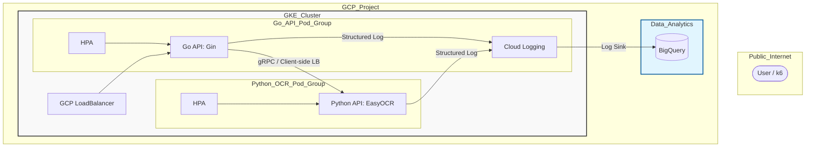

# 1.はじめに
前回の記事で、GoとPythonをgRPCで繋ぎ、GKE上にスケーラブルなOCR基盤を構築し、そのポイントを説明しました。
本記事では、そのプロジェクト詳細を説明します。


| ◆構成 |
|:---------------|
|[1.はじめに](#1はじめに) |
|[2.技術スタックとシステム構成](#2技術スタックとシステム構成)|
|[3.「GitHub ActionsによるCIの自動化」の環境構築](#3github-actionsによるciの自動化の環境構築)|
|[4.「GitHub Actions」の実行方法](#4github-actionsの実行方法)|
|[5.実行結果](#5実行結果)|
|[6.まとめ](#6まとめ)|

# 2.技術スタックとシステム構成

## 2-1. 技術スタック

本システムでは、以下の技術スタックを採用しています。


| カテゴリ | 技術・ツール | 用途 |
| :--- | :--- | :--- |
| **Frontend API** | **Go (Gin)** | HTTPリクエスト受付、gRPCクライアント、構造化ログ出力 |
| **Inference Engine** | **Python (EasyOCR)** | gRPCサーバー、EasyOCRによる文字認識処理 |
| **Communication** | **gRPC / Protocol Buffers** | Go-Python間の高速・型安全なマイクロサービス通信 |
| **Infrastructure** | **GKE (Standard)** | コンテナオーケストレーション、HPAによるオートスケーリング |
| **IaC** | **Terraform** | VPC, GKE, Artifact Registry, Log Sinkのコード管理 |
| **Observability** | **Cloud Logging / BigQuery** | 構造化ログの集約、およびSQLによる推論精度・性能分析 |
| **Testing** | **k6** | 期待値（正解データ）を用いた高負荷・精度検証試験 |


### 2-2. 主要ライブラリ
特に注目すべき採用ライブラリは以下の通りです。

| 対象 | ライブラリ | 採用理由 |
| :--- | :--- | :--- |
| **Go** | **Gin** | 軽量かつ高速で、構造化ログとの相性が良いため。 |
| **Go** | **gopsutil** | Pod内のリソース使用率をログに含め、分析に活用するため。 |
| **Python** | **EasyOCR** | PyTorchベースで精度が高く、日本語・英語に標準対応しているため。 |
| **Python** | **psutil** | 推論時のCPU負荷を正確に計測し、ログ出力するため。 |
| **Common** | **gRPC** | HTTP/1.1よりも低遅延で、双方向通信やストリーミングにも対応可能なため。 |


## 2-3. ディレクトリ構成
インフラ管理（Terraform）コマンドで、デプロイできる以下の構成となっています。
このデータセットは、GitHubレポジトリ登録しています。

https://github.com/wata123-t/AES-128_GitHub_Actions

```text
.
├── terraform/          # GKE, VPC, Artifact Registry, Log Sinkの定義
├── chart/              # Kubernetesデプロイ用リソース (Helm Chart形式)
│   └── templates/      # Deployment, Service, HPA, RBACのマニフェスト
├── go-api/             # フロントエンドAPI (Go / Gin)
├── python-api/         # 推論エンジン (Python / EasyOCR / gRPC Server)
├── pb/                 # gRPC定義ファイル (.proto) と自動生成コード
└── k6/                 # 負荷試験スクリプト
    └── test_images/    # 検証用画像および正解データ(mapping.json)
```

## 2-3. システム構成
本プロジェクトは、設計・検証・分析の各工程を GitHub Actions で統合しています。全体のデータの流れと、各記事の解説範囲は以下の通りです。


```mermaid
graph TD
    subgraph Public_Internet
        User([User / k6])
    end

    subgraph GCP_Project
        subgraph GKE_Cluster
            LB[GCP LoadBalancer]
            
            subgraph Go_API_Pod_Group
                HPA_Go[HPA] --> Go[Go API: Gin]
                Go --> |Structured Log| CL[Cloud Logging]
            end

            subgraph Python_OCR_Pod_Group
                HPA_Py[HPA] --> Py[Python API: EasyOCR]
                Py --> |Structured Log| CL
            end

            LB --> Go
            Go --> |gRPC / Client-side LB| Py
        end

        subgraph Data_Analytics
            CL --> |Log Sink| BQ[(BigQuery)]
        end
    end

    style GKE_Cluster fill:#f9f9f9,stroke:#333,stroke-width:2px
    style Data_Analytics fill:#e1f5fe,stroke:#01579b,stroke-width:2px
```
### <ins>_◆関係記事_</ins>

本記事は、これまでの内容を自動化させるものとなります。

**・1.[【ハード・ソフト協調検証①】Verilog HDLによる暗号化回路(AES-128)の設計](https://qiita.com/watapy/items/cc216b77695b3435f2f5)**
図の Verilog RTL の中身、ハードウェア設計の詳細について解説しています。

これまでの内容を GitHub Actions と Terraform を使用して「プッシュ即検証・分析」が走るパイプラインの構築をしており、今回の記事で説明しています。


# 3.APIサーバー(Go)
Goを使用したAPIサーバーの構成について解説します。今回、初めてGoを使用するため、AIと相談しながら「GKE上での安定稼働」と「低レイテンシ」を目標に構築しました。
フロントエンドのGo APIと、バックエンドのPython OCRエンジンの通信には、パフォーマンスを最大限に引き出すため **gRPC** を採用しています。


## 3-1.gRPC通信（Protocol Buffers）による最適化
単純なREST（HTTP/1.1）ではなくgRPCを採用した理由は、型定義の厳密さと転送効率です。

**・データ転送の効率化:** 画像のようなバイナリデータは、JSONではBase64エンコードによる肥大化（約1.3倍）を招きますが、gRPCでは bytes 型としてそのまま転送できるため、帯域を節約できます。
**・型安全なインターフェース:** .proto ファイルからGo/Python両方のコードを生成することで、言語間の「解釈の不一致」をコンパイルレベルで排除しています。


```golang:./pb/predict.proto
syntax = "proto3";
package ocr;

service Predictor {
  rpc Predict (ImageRequest) returns (PredictResponse);
}

message ImageRequest {
  bytes image_data = 1; // 画像をバイナリで高速転送
}

message PredictResponse {
  string result = 1;
}

```

## 3-2.プログラム実行フロー

軽量で高速なWebフレームワーク **Gin** を使用し、起動時にgRPCクライアントを初期化した後、リクエストを待ち受けます。

```golang:./go-api/main.go
	log.Printf("Go API Server started on :8080 (Timeout: %ds)", timeoutSec)
    // サーバーを起動し、リクエストをブロッキングして待ち受ける
	r.Run(":8080")
}
```

## 3-3.GKE環境での負荷分散と再接続戦略
GKE上で複数のPython Podが動く構成において、特定のPodに負荷が偏るのを防ぐため、 **クライアントサイド・ロードバランシング** を実装しています。
Python側ではgoとの接続を30秒で切断する動作仕様ですが、**gRPCクライアント** がバックグラウンドで自動的に再接続を試みます。
このコード内で、接続の状態を逐一チェックしたり再接続ロジックを書いたりする必要がなく、常に繋がっているものとして扱えるのが大きな利点です。


```golang:./go-api/main.go
	// 1. Pythonサーバーへの「通信経路」を確立（この時点ではまだ土台作り）
	conn, err := grpc.Dial(
		targetAddr,
		grpc.WithTransportCredentials(insecure.NewCredentials()), // 暗号化なしで接続
		grpc.WithDefaultServiceConfig(serviceConfig),             // 負荷分散ルールの適用
		grpc.WithKeepaliveParams(keepalive.ClientParameters{
			Time:                10 * time.Second, // 10秒ごとに生存確認(ヘルスチェック)
			Timeout:             time.Second,      // 生存確認の応答待機（1秒）
			PermitWithoutStream: true,             // アイドル時も生存確認を許可
		}),
	)
	// 2. 接続そのものに失敗した場合（住所間違いや相手が起動していない等）は即終了
	if err != nil {
		log.Fatalf("gRPC接続失敗: %v", err)
	}
	// 3. 【重要】プログラム終了時（main関数終了時）に必ず回線を閉じるよう予約
	defer conn.Close()
	// 4. 確立した回線(conn)を使い、Pythonの機能を呼び出すための「専用窓口(クライアント)」を作成
	client := pb.NewPredictorClient(conn)
```

## 3-4.POSTリクエスト処理と相関ID
外部から受け取った画像と検証用の期待値を処理します。
外部からPOSTリクエストを受け取ると、以下の記述部から処理が実行されます。

```golang:./go-api/main.go
	r.POST("/predict", func(c *gin.Context) {
		startTime := time.Now()
        ............
        ............
	})
```

以下の処理内容が実施されます。

|概要|処理内容 |
| :--- | :--- |
|リクエストID(相関ID)の生成|X-Correlation-ID ヘッダーから取得し、なければ新規生成。Python側へも引き継ぎます|
|正解文字列の取得|負荷試験時の精度計測用|
|画像データの読み込み|multipart/form-data から取得|
|gRPCコンテキスト準備|タイムアウト設定とメタデータの埋め込み|
|Python OCRエンジンへ送信|生成したgRPCクライアントを使用|


## 3-5.精度検証（期待値比較）
推論結果が正しいかどうかをその場で判定します。この結果をログに含めることで、後にBigQueryで「どの画像が苦手か」を統計的に抽出できるようにしています。

```golang:./go-api/main.go
		// 7. 合否判定
		isMatch := false
		if isSuccess && expectedText != "" {
			// OCR結果に期待する文字列が含まれているか
			isMatch = strings.Contains(res.Result, expectedText)
		}
```

## 3-6.Cloud Logging を活用した分析基盤
運用監視と分析のため、ログはすべて JSON形式の構造化ログ として標準出力します。
これを Google Cloud Logging が自動回収し、BigQuery へシンク（転送）します。

```golang:./go-api/main.go
		logEntry := CloudLog{
			Severity:  "INFO",
			RequestID: requestID,
			Step:      "go-api-complete",
			LatencyMs: duration,
			IsSuccess: isSuccess,
			CPUUsage:  cpuVal,
			PodName:   podName,
			Expected:  expectedText,
			IsMatch:   isMatch,
			Message:   fmt.Sprintf("OCR Processed by %s", podName),
		}
        ............
        ............
		// 標準出力をJSON化。Cloud Loggingはこれを自動解析してフィールド分割してくれる
		logJSON, _ := json.Marshal(logEntry)
		fmt.Println(string(logJSON))
	})
```


## 3-7.全コード
コード詳細は、こちらを参照して下さい。
<details>
<summary>./go/main.go</summary>

```go
package main

import (
	"context"
	"encoding/json"
	"fmt"
	"io"
	"log"
	"net/http"
	"os"
	"strconv"
	"strings" // ★追加: 文字列比較用
	"time"

	"github.com/gin-gonic/gin"
	"github.com/shirou/gopsutil/v4/cpu"
	"google.golang.org/grpc"
	"google.golang.org/grpc/credentials/insecure"
	"google.golang.org/grpc/keepalive"
	"google.golang.org/grpc/metadata"

	"go-api/pb"
)

// Cloud Logging用の構造化ログ
type CloudLog struct {
	Severity  string  `json:"severity"`
	RequestID string  `json:"request_id"`
	Step      string  `json:"step"`
	LatencyMs int64   `json:"duration_ms"`
	IsSuccess bool    `json:"is_success"`
	CPUUsage  float64 `json:"cpu_usage"`
	PodName   string  `json:"pod_name"`
	Message   string  `json:"message"`
	Expected  string  `json:"expected"` // ★追加: 期待する正解文字列
	IsMatch   bool    `json:"is_match"` // ★追加: 合否判定結果
}

func main() {
	podName, _ := os.Hostname()
	if podName == "" {
		podName = "unknown-go-pod"
	}

	// 環境変数からタイムアウト設定を取得
	timeoutStr := os.Getenv("TIMEOUT_SECONDS")
	timeoutSec, err := strconv.Atoi(timeoutStr)
	if err != nil {
		timeoutSec = 15
	}

	// gRPC 接続設定
	serviceConfig := `{"loadBalancingConfig": [{"round_robin":{}}]}`
	targetAddr := os.Getenv("PYTHON_RPC_ADDR")
	if targetAddr == "" {
		targetAddr = "localhost:50051"
	}

	conn, err := grpc.Dial(
		targetAddr,
		grpc.WithTransportCredentials(insecure.NewCredentials()),
		grpc.WithDefaultServiceConfig(serviceConfig),
		grpc.WithKeepaliveParams(keepalive.ClientParameters{
			Time:                10 * time.Second,
			Timeout:             time.Second,
			PermitWithoutStream: true,
		}),
	)
	if err != nil {
		log.Fatalf("gRPC接続失敗: %v", err)
	}
	defer conn.Close()
	client := pb.NewPredictorClient(conn)

	r := gin.Default()

	r.POST("/predict", func(c *gin.Context) {
		startTime := time.Now()

		// 1. リクエストID（相関ID）の取得または生成
		requestID := c.GetHeader("X-Correlation-ID")
		if requestID == "" {
			requestID = fmt.Sprintf("gen-%d", startTime.UnixNano())
		}

		// ★追加: k6等から送られてくる正解文字列の取得
		expectedText := c.GetHeader("X-Expected-Text")

		// 2. 画像データの読み込み
		file, header, err := c.Request.FormFile("image")
		if err != nil {
			c.JSON(http.StatusBadRequest, gin.H{"error": "ファイル取得エラー"})
			return
		}
		defer file.Close()

		imageData, _ := io.ReadAll(file)
		log.Printf("[%s] 受信: %s (%d bytes)", requestID, header.Filename, len(imageData))

		// 3. gRPCコンテキストの準備
		ctx := metadata.AppendToOutgoingContext(context.Background(), "x-correlation-id", requestID)
		ctx, cancel := context.WithTimeout(ctx, time.Duration(timeoutSec)*time.Second)
		defer cancel()

		// 4. Python OCRエンジンへリクエスト送信
		res, err := client.Predict(ctx, &pb.ImageRequest{ImageData: imageData})

		// 5. メトリクス収集とログ出力
		percent, _ := cpu.Percent(0, false)
		var cpuVal float64
		if len(percent) > 0 {
			cpuVal = percent[0]
		}

		isSuccess := (err == nil)
		duration := time.Since(startTime).Milliseconds()

		// ★追加: 正解の合否判定
		isMatch := false
		if isSuccess && expectedText != "" {
			// OCR結果に期待する文字列が含まれているか
			isMatch = strings.Contains(res.Result, expectedText)
		}

		logEntry := CloudLog{
			Severity:  "INFO",
			RequestID: requestID,
			Step:      "go-api-complete",
			LatencyMs: duration,
			IsSuccess: isSuccess,
			CPUUsage:  cpuVal,
			PodName:   podName,
			Expected:  expectedText, // ★追加
			IsMatch:   isMatch,      // ★追加
			Message:   fmt.Sprintf("OCR Processed by %s", podName),
		}
		
		if isSuccess {
			logEntry.Message = fmt.Sprintf("Expected: %s, Got: %s", expectedText, res.Result)
		} else {
			logEntry.Severity = "ERROR"
			logEntry.Message = fmt.Sprintf("Predict error: %v", err)
		}

		logJSON, _ := json.Marshal(logEntry)
		fmt.Println(string(logJSON))

		// 6. レスポンス返却
		if !isSuccess {
			c.JSON(http.StatusInternalServerError, gin.H{"error": "OCR処理エラーまたはタイムアウト", "id": requestID})
			return
		}

		c.JSON(http.StatusOK, gin.H{
			"message": "推論完了",
			"result":  res.Result,
			"id":      requestID,
		})
	})

	log.Printf("Go API Server started on :8080 (Timeout: %ds)", timeoutSec)
	r.Run(":8080")
}

```

</details>


# 4.推論サーバ(python)
バックエンドのPython側では、 **EasyOCR** を使用した推論エンジンを構築しました。Go側と同様、gRPCを採用することで「通信」と「ロジック」を分離し、高負荷な処理を安定してこなす工夫を盛り込んでいます。

## 4-1.gRPCによるリクエスト待ち受け
Python側も .proto から生成されたコードを使用します。

```python:./python-ocr/server.py
class Predictor(pb2_grpc.PredictorServicer):
    def Predict(self, request, context):
        # ここがGoからのリクエストを受け取る「ハンドラ」
        # request.image_data には既に画像バイナリが入っている
        img = Image.open(io.BytesIO(request.image_data))

```

## 4-2.重いモデルのライフサイクル管理
OCRエンジン（モデル）のロードには時間がかかります。リクエストのたびにロードするのではなく、**プロセスの起動時に一度だけロード**し、メモリ上に保持（ホットスタンバイ）させるのが鉄則です。

```python:./python-ocr/server.py
# サーバー起動時に一度だけ実行
reader = easyocr.Reader(['en', 'ja'], gpu=False)
```

## 4-3.gRPC Connection Ageによる「負荷の再分散」
GKE（L4ロードバランサー）環境下でgRPCを使う際、一度確立したコネクションが特定のPodに固定され続けてしまい、スケールアウトした新しいPodにリクエストが流れない「負荷の偏り」が発生します。これを防ぐため、 **サーバー側でコネクションの寿命をあえて制限** しています。

```python:./python-ocr/server.py
    # 接続の最大寿命を30秒に設定
    server_options = [
        ('grpc.max_connection_age_ms', 30000), # 30秒経ったら接続をリフレッシュさせる
        ('grpc.max_connection_age_grace_ms', 5000),
    ]
```
これによって、Go（クライアント）側は定期的に接続を再確立し、そのタイミングでK8sのService（kube-proxy）による適切な再負荷分散が行われます。


## 4-4.分散トレーシングと構造化ログ
システムの可観測性を高めるため、以下の工夫を行っています。

**・コンテキストの抽出:** context.invocation_metadata() からIDを取得。
**・構造化ログ:** Go側と同じフォーマットでJSONログを出力。Cloud Logging上で、一つのリクエストが「Go APIをいつ通り、Python側で何ミリ秒かかったか」を一気通貫で検索（分散トレース）できるようになります。


```python:./python-ocr/server.py
# Goから渡されたIDを取得し、処理時間やCPU使用率と共にJSON出力
log_entry = {
    "severity": "INFO",
    "request_id": request_id, # これがGo側と一致する
    "duration_ms": duration_ms,
    "pod_name": POD_NAME,
    "message": f"OCR completed: {result_text[:50]}..."
}
print(json.dumps(log_entry))
```

## 4-5.リソース使用率の可視化
psutil を使い、推論直後のCPU使用率をログに記録しています。これにより、　**「特定の画像サイズでCPUがスパイクしている」** といったボトルネックの特定や、HPA（Horizontal Pod Autoscaler）の閾値設定の判断材料として活用できます。


# 5.Helmによるインフラ管理

## 5-1.helm とは、
Kubernetesのパッケージマネージャーです。Terraformが「Nodeやネットワークなどの土台（インフラ層）」を作るのに対し、Helmは「その上で動く複数のアプリケーション（アプリ層）」を効率よく管理します。


具体的には、以下の3つの役割を担います。

**テンプレート化（共通化）**
Go APIもPython OCRも、DeploymentやServiceの「形」はほぼ同じです。Helmを使うことで、共通のひな形を作成し、中身の数値（イメージ名やCPU制限）だけを差し替えることが可能になります。


**一括デプロイ**
deployment.yaml、service.yaml、hpa.yaml など、バラバラなファイルを「1つのアプリケーション（Chart）」としてまとめてデプロイ・管理できます。

**環境差分の吸収**
values.yaml を切り替えるだけで、「開発環境は1ポッド」「本番環境は最小5ポッド」といった構成変更が、コードを書き換えずに実現できます。

## 5-2. values.yaml
システム全体の「設計図」です。特にPython側のリソースは、EasyOCRのモデル展開用に **メモリを最低1GB（Limit 2GB）** 確保し、推論中にPodがOOM（Out Of Memory）で即死するのを防いでいます。

```hcl
# 抜粋：gRPC通信を有効化する設定
go:
  env:
    # dns:/// を指定することでクライアントサイドロードバランシングを有効化
    PYTHON_RPC_ADDR: "dns:///python-api-svc:50051"

```


## 5-3. deployment.yaml
range を使ってGoとPythonのDeploymentを共通化しています。ポイントは env セクションで、メタデータから POD_NAME を取得し環境変数に注入している点です。これにより、前述の「構造化ログ」にどのPodが処理したかを出力可能にしています。

## 5-4. service.yaml
ここが本構成のキモです。Python側のServiceを Headless Service (clusterIP: None) として定義しています。

Python側のServiceを Headless Service (clusterIP: None) として定義しています。通常のServiceではgRPCのコネクションが特定のPodに固定されてしまいますが、Headlessにすることで、Go API側が全PodのIPを直接把握し、リクエストを均等に分散（クライアントサイド・ロードバランシング）できるようになります

**・なぜHeadlessか？:** 通常のService（ClusterIP）では、gRPCのHTTP/2コネクションが1つのPodに固定されてしまいます。

**・効果:** Headlessにすることで、Go API（Client）側がPython Pod個別のIPアドレスを直接解決できるようになり、クライアントサイドでの Round Robin負荷分散 が可能になります。

## 5-5. hpa.yaml
OCR処理は非常にCPU負荷が高いため、HorizontalPodAutoscaler を設定しています。targetCPU: 70 とやや高めに設定することで、一時的なスパイクによる頻繁なスケールイン・アウト（スラッシング）を抑制し、安定性を高めています。


## 5-6. rbac.yaml
Go API側がK8sのAPIサーバーにアクセスし、Python Podの増減を監視（Watch）するために必要な権限を定義しています。pod-reader ロールを付与することで、サービスディスカバリ（名前解決）の精度を担保します。
Go API側がPython Podの増減を正しく検知するために必要な権限（EndpointsやPodsの参照権限）を定義しています。

# 6.Terraformによるインフラ自動化
システムの土台となるGCPリソースはすべてTerraformで構成（IaC）しています。単にサーバーを立てるだけでなく、「安く、止まらず、分析しやすい」基盤をコードで定義しています。

## 6-1.ログの資産化（Cloud Logging → BigQuery）
本システムの最大の特徴は、出力した構造化ログをリアルタイムでBigQueryへ転送（Sink）している点です。

**・google_logging_project_sink:** jsonPayload.request_id:* というフィルタをかけることで、アプリケーションの重要なログだけを抽出してBigQueryへ流し込みます。

**・メリット:** Cloud Loggingの保存期間を気にせず、SQLを使って「時間帯別のOCR精度」や「Podごとの処理遅延」を瞬時に分析できるようになります。


## 6-2.コスト最適化とオートスケーリング
OCR処理は負荷が高い反面、常にフル稼働させる必要はありません。

**・Spotインスタンスの採用:** spot = true 設定により、通常の3分の1程度のコストで計算リソースを確保します。

**・Cluster Autoscaler:** autoscaling ブロックにより、ノード（マシン）自体も負荷に応じて1台から4台まで自動増減させます。HPA（Podの増減）と連動して、インフラ全体が伸縮します。


## 6-3.ネットワーク設計（VPC & Subnet）
K8sクラスターを構築する際、将来の拡張を見越してセカンダリIP範囲（Pod用・Service用）を明示的に定義しています。

```hcl
secondary_ip_range {
  range_name    = "pod-ranges"
  ip_cidr_range = "192.168.16.0/20" # Podに割り当てられる広大なIP帯域
}
```

## 6-4.Artifact Registry

ビルドしたGoとPythonのDockerイメージを管理するプライベートリポジトリを定義しています。GKEとの親和性が高く、高速なイメージプルが可能です。


# 7.デプロイ手順
本システムのコードは GitHub（[ここにURL]）に公開しています。以下の手順で、インフラの構築からアプリケーションのデプロイまでを再現可能です。


## 7-1. インフラの構築 (Terraform)
まず、GCP上にGKEクラスタやArtifact Registryを構築します。

```bash
cd terraform
terraform init
terraform apply -var="project_id=YOUR_PROJECT_ID"
```


## 7-2. イメージのビルドとプッシュ
GoとPythonの各イメージをビルドし、Artifact Registryへプッシュします。

```bash
# Artifact Registryへの認証
gcloud auth configure-docker asia-northeast1-docker.pkg.dev

# ビルドとプッシュ（例：Python）
docker build -t asia-northeast1-docker.pkg.dev/YOUR_PROJECT_ID/ocr-images/python-api:latest ./python-api
docker push asia-northeast1-docker.pkg.dev/YOUR_PROJECT_ID/ocr-images/python-api:latest
```


## 7-3. アプリケーションのデプロイ (Helm)
Helmを使用して、K8sリソース（Deployment, Service, HPAなど）を一括デプロイします。

```bash
# 接続先クラスタを切り替え
gcloud container clusters get-credentials ocr-cluster --region asia-northeast1-a

# Helmチャートをインストール
helm install ocr-system ./chart
```


# 8.おわりに（構築編のまとめ）
本記事では、GoとPython、そしてGKEを組み合わせた **「実戦的なOCR基盤」** の構築過程を解説しました。
単に文字認識を行うだけでなく、
**・gRPC**によるマイクロサービス間の高速通信
**・Terraform**によるコードベースのインフラ管理
**・Headless Service**を用いたK8s上での適切な負荷分散
**・BigQuery**を見据えた構造化ログの設計
といった、データエンジニアリングにおいて不可欠な「スケーラビリティ」と「観測性」を意識した設計を盛り込みました。

### **次回予告：高負荷試験による限界突破の検証**
構築したこの基盤は、果たして実際の高負荷環境下でどのような挙動を見せるのでしょうか？
次回の**【検証編】**では、負荷試験ツール **k6** を用い、正解データ（Ground Truth）を突き合わせながら以下の項目を徹底検証します。

**・オートスケーリングの真価:** HPAによってPodやNodeが動的に増減する様子の可視化。
**・データ品質の分析:** BigQueryに蓄積されたログをSQLで集計し、負荷増加時のレイテンシやOCR正解率の推移を算出。
**・システムの限界性能:** リソース制限（1CPU/2GB）下での最適なスループットの特定。

インフラが「データ」で語る瞬間を、ぜひ次回の記事でご覧ください。


--------------------------------------------
---------------------
<details>
<summary>コード(.github/workflows/verify.yml)</summary>

```yaml
name: AES-128 検証パイプライン
        run: |
          cd ./terraform
          terraform destroy -auto-approve \
            -var="project_id=${{ secrets.GCP_PROJECT_ID }}"
```

</details>


### <ins>_◆効率化ポイント_</ins>

>#### ①`workflow_dispatch` でデバッグを快適に
GitHub 画面に **「手動実行ボタン」** を表示させる設定です。
**●メリット:** `git push` しなくても、ボタン一つで再実行が可能。今回のような Terraform や dbt を含む重い処理で、「環境設定だけ変えて試したい」という時のデバッグ効率が圧倒的に向上します。
>#### ②「ステップ名（表示名）」の日本語化
 **`-name`:** に日本語を使用すると、実行画面の実用性がグンと上がります。

**・エラーの早期発見:** どの工程で失敗したのか、英語のログを読み解く前に直感的にわかります。
**・進捗の可視化:** 「どこまで処理が進んだか」がひと目で判断でき、運用・メンテナンスのストレスを軽減します。

:::note info
不要になった履歴は、個別に、または一括で削除することも可能です。
:::


## 4-2.実行コマンド
自分のGitHubリポジトリで`GitHub Actions`(自動化)を試すための手順となります。

```bash
# 1. ソースコードをローカルにダウンロード
git clone https://github.com/wata123-t/AES-128_GitHub_Actions

# 2. プロジェクトのディレクトリへ移動
cd AES-128_GitHub_Actions

# 3. Gitリポジトリとして初期化
git init

# 4. 全てのファイルをコミット対象に追加
git add .

# 5. 現在の状態をローカルに記録
git commit -m "Initial commit"

# 6. 自分のGitHubリポジトリを送信先に設定
git remote add origin (あなたのリポジトリURL)

# 7. メインブランチ名を「main」に設定
git branch -M main

# 8. 自分のリポジトリへデータを反映
git push -u origin main
```
