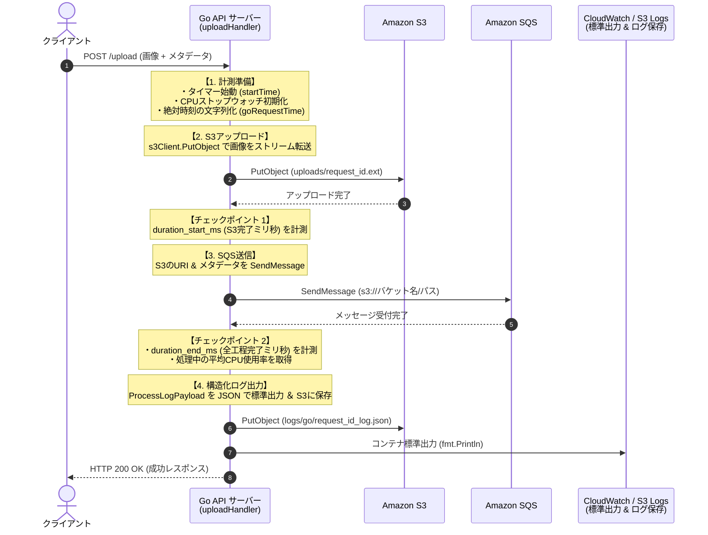
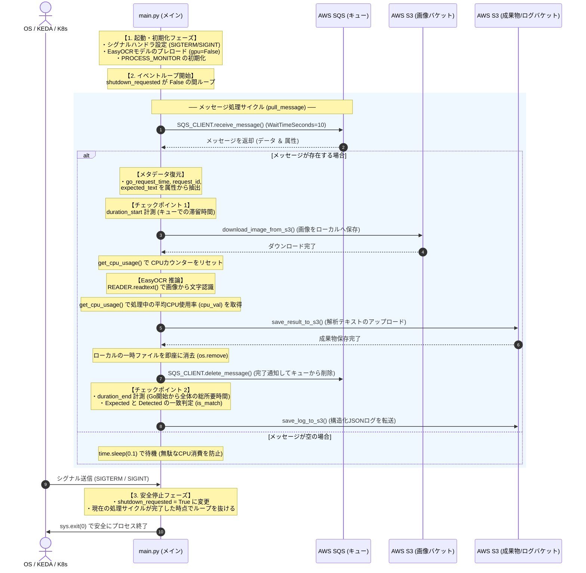

# 1.はじめに
本ポートフォリオでは、過去にGoogle Cloud（GKE）で構築した「Go×Pythonによる非同期OCRバックエンド基盤」をベースに、AWS（EKS）環境へのリプレイスおよびアーキテクチャの最適化を行いました。
「Go言語による高速なAPI受付」と「Pythonによる重い画像解析（EasyOCR）」を、Amazon SQSを介して完全に切り離した非同期パイプラインを構成。
クラウド事業者間の仕様差を考慮しつつ、AWSのマネージドサービスを最大限に活用したスケーラブルなインフラ構築に関する詳細説明を行います。


| ◆構成 |
|:---------------|
|[1.はじめに](#1はじめに) |
|[2.技術スタックとシステム構成](#2技術スタックとシステム構成)|
|[3.APIサーバー(Go)](#3apiサーバーgo)|
|[4.推論サーバ(python)](#4推論サーバpython)|
|[5.Terraformによるインフラ自動化](#5terraformによるインフラ自動化)|
|[6.Helmによるワークロード管理](#6helmによるワークロード管理)|
|[7.デプロイ手順](#7デプロイ手順)|
|[8.おわりに](#8おわりに)|


# 2.技術スタックとシステム構成

## 2-1. 技術スタック
本システムでは、以下の技術スタックを採用しています。GCP基盤での設計思想である **「疎結合」「非同期バッファリング」「イベント駆動型オートスケール」** をそのまま継承し、エンタープライズ環境で広く採用されているAWS（Amazon EKS）環境へと完全リプレイスしました。


| カテゴリ | 技術・ツール | 用途 |
| :--- | :--- | :--- |
| **Frontend API** | **Go (Standard)** |HTTPリクエスト受付、Amazon S3への画像および構造化JSONログのアップロード、SQSメッセージ送信|
| **Inference Engine** | **Python (EasyOCR)** |Amazon SQSからのメッセージ受信、S3からの画像ダウンロード、文字認識処理、結果のS3保存|
| **Messaging (Buffer)** | **Amazon SQS** |Go-Python間の通信を仲介するメッセージキュー。スパイク負荷をバッファリングし、推論サーバーを保護|
| **Autoscaling** | **KEDA** |SQSの未処理メッセージ数（ApproximateNumberOfMessages）を検知し、Podを高速にイベント駆動スケール|
| **Infrastructure** | **Amazon EKS** | **XXXXXXXXXXXXXXXXX** |
| **IaC** | **Terraform** |VPC、NAT Gateway、EKS、SQS、S3、IAMロールなどのAWS全インフラリソースのコード管理（IaC）|


### 2-2. 主要ライブラリ
新アーキテクチャのパフォーマンスとコスト最適化を最大化するために採用した主要ライブラリ・ツールです。


| 対象 | ライブラリ | 採用理由 |
| :--- | :--- | :--- |
| **Go** | **aws/aws-sdk-go-v2** |AWSの推奨するSDK v2。S3への高速なオブジェクト書き込みおよびSQSへの軽量なメッセージ送信を実現するため|
| **Go** | **gopsutil** |1リクエストの処理期間中における純粋なCPU使用率を正確に計測し、構造化ログへ含めるため|
| **Python** | **EasyOCR** |PyTorchベースで精度が高く、日本語・英語に標準対応。今回はコンテナ起動時にプレロードしてコールドスタートを排除|
| **Python** | **psutil** |OCR推論時のCPU負荷をノンブロッキングで計測し、分析用の構造化ログに出力するため|
| **K8s** | **KEDA (AWS SQS Scaler)** |SQSのキュー滞留数に応じてPod数を「1台⇄最大5台」までミリ秒単位で高感度スケールさせるため|
| **AWS / K8s** | **IRSA (IAM Roles for Service Accounts)** |AWS秘密鍵のコンテナ内保持を完全に撤廃。OIDC認証を介してPod単位で安全にS3/SQSへのアクセス権限を借用するため|

## 2-3. ディレクトリ構成
インフラ管理（Terraform）コマンドで、デプロイできる以下の構成となっています。
このデータセットは、[GitHubレポジトリ]() に登録しています。


```text
.
├── terraform/      # EKS, VPC などの定義
├── go/             # フロントエンドAPI (Go / Gin)
└── python/         # 推論エンジン (Python / EasyOCR )

```

## 2-3. システム構成

### 1. 「データフロー」処理フェーズ（①〜⑪）


--------------------
--------------------

# 3.APIサーバー(Go)

本システムの入り口となるGo APIサーバー（uploadHandler）は、クライアントからの画像アップロードを受け付け、AWSのマネージドサービス（S3/SQS）へ迅速にタスクを委譲（非同期化）します。同期処理のボトルネックを徹底的に排除・可視化するため、処理の裏側でミリ秒単位のタイムスタンプ計測（duration_start_ms / duration_end_ms）を実施しています。

gopsutil ライブラリを用いたリクエスト単位のピンポイントなCPU使用率は適切な値が取得が難しいために検証時には使用しない予定です。



```mermaid
sequenceDiagram
    autonumber
    actor Client as クライアント
    participant GoServer as Go API サーバー<br>(uploadHandler)
    participant S3 as Amazon S3
    participant SQS as Amazon SQS
    participant LogSystem as CloudWatch / S3 Logs<br>(標準出力 & ログ保存)

    Client->>GoServer: POST /upload (画像 + メタデータ)
    
    Note over GoServer: 【1. 計測準備】<br>・タイマー始動 (startTime)<br>・CPUストップウォッチ初期化<br>・絶対時刻の文字列化 (goRequestTime)
    
    Note over GoServer: 【2. S3アップロード】<br>s3Client.PutObject で画像をストリーム転送
    GoServer->>S3: PutObject (uploads/request_id.ext)
    S3-->>GoServer: アップロード完了
    
    Note over GoServer: 【チェックポイント 1】<br>duration_start_ms (S3完了ミリ秒) を計測
    
    Note over GoServer: 【3. SQS送信】<br>S3のURI & メタデータを SendMessage
    GoServer->>SQS: SendMessage (s3://バケット名/パス)
    SQS-->>GoServer: メッセージ受付完了
    
    Note over GoServer: 【チェックポイント 2】<br>・duration_end_ms (全工程完了ミリ秒) を計測<br>・処理中の平均CPU使用率を取得
    
    Note over GoServer: 【4. 構造化ログ出力】<br>ProcessLogPayload を JSON で標準出力 ＆ S3に保存
    GoServer->>S3: PutObject (logs/go/request_id_log.json)
    GoServer->>LogSystem: コンテナ標準出力 (fmt.Println)
    
    GoServer-->>Client: HTTP 200 OK (成功レスポンス)

```

これを構成するファイルは、以下の3つとなります。
概要は、こちらです。


| ファイル名 | 概要 |
| :--- | :--- |
|types.go|データ構造の定義|
|handlers.go|メインロジックの実行|
|main.go|サーバーの起動とAWS初期化|


詳細は以下の通り。


## 3-1.types.go
システム全体の可観測性（Observability）を支えるための構造化ログのデータスキーマ（型）を定義しているファイルです。

<details>
<summary>./go/type.go</summary>

```go
package main

// ProcessLogPayload はS3出力および標準出力（コンテナログ）で共通利用する構造化ログの定義です。
type ProcessLogPayload struct {
	RequestID     string  `json:"request_id"`
	Step          string  `json:"step"`
	DurationStart int64   `json:"duration_start_ms"` // S3への画像書き込み完了までのミリ秒
	DurationEnd   int64   `json:"duration_end_ms"`   // SQSへのキュー投入完了までのミリ秒
	CPUUsage      float64 `json:"cpu_usage"`
	PodName       string  `json:"pod_name"`
	Expected      string  `json:"expected"`
	Status        string  `json:"status"`
}


```
</details>

## 3-2.handlers.go
クライアントから送られた画像リクエストを検証し、S3への永続化とSQSへのキュー投入をアトミック（連続的）に実行するコアロジックです。

**・リクエスト単位の精密プロファイリング:**
ハンドラーの最先頭で startTime の記録と cpu.Percent(0, false) によるCPUストップウォッチのリセットを行います。
一連のAWS処理が完了した直後に再度計測することで、「このリクエストを捌くためだけに消費されたミリ秒時間と純粋なCPU負荷」をピンポイントで算出しています。

**・ストリーミングによるメモリ最適化:**
r.FormFile("image") で取得したファイルオブジェクトを、ローカルディスクに書き出すことなく直接 s3Client.PutObject の Body に渡して転送（ストリーム転送）しています。
サーバー側のメモリを浪費しないため、大量の同時画像アップロードに耐えられる設計です。

**・疎結合なパイプライン（非同期委譲）の構築:**
画像をS3に保存した直後、そのS3のURI（s3://...）やクライアントから受け取ったメタデータ（request_id や期待値 expected）をメッセージ属性（MessageAttributes）としてSQSへ SendMessage します。
重い処理（AI解析など）は後続のPythonワーカーに任せ、Go側は即座に応答を返すため、クライアントの待ち時間を劇的に短縮します。


**・信頼性の高いログの2重永続化:**
計測した全データ（ProcessLogPayload）をJSON化し、コンテナの標準出力（fmt.Println）に流すだけでなく、S3内の logs/go/ ディレクトリにも即座に保存しています。
これにより、コンテナが不意に削除された場合でも、処理の統計データや監査ログが失われない強固な可用性を実現しています。


<details>
<summary>./go/handlers.go</summary>

```go
package main

import (
	"encoding/json"
	"fmt"
	"log"
	"net/http"
	"os"
	"path/filepath"
	"strings"
	"time"

	"github.com/aws/aws-sdk-go-v2/aws"
	"github.com/aws/aws-sdk-go-v2/service/s3"
	"github.com/aws/aws-sdk-go-v2/service/sqs"
	"github.com/aws/aws-sdk-go-v2/service/sqs/types"
	"github.com/shirou/gopsutil/v4/cpu"
)

// uploadHandler はフロントエンドからの画像アップロードを受け付け、S3保存とSQSキュー投入を行います。
func uploadHandler(w http.ResponseWriter, r *http.Request) {
	startTime := time.Now()

	// CPUストップウォッチのリセット
	_, _ = cpu.Percent(0, false)

	// 絶対時刻を「秒.ミリ秒」の文字列として生成
	goRequestTime := fmt.Sprintf("%f", float64(startTime.UnixNano())/1e9)

	if r.Method != http.MethodPost {
		http.Error(w, "POSTメソッドのみ受け付けます", http.StatusMethodNotAllowed)
		return
	}

	podName := os.Getenv("POD_NAME")
	if podName == "" {
		podName = "local-aws-container"
	}

	requestID := r.FormValue("request_id")
	expectedText := r.FormValue("expected")

	if requestID == "" {
		requestID = fmt.Sprintf("req-%d", startTime.UnixNano())
	}

	// クライアントから送信された実際の画像ファイルを取得
	file, header, err := r.FormFile("image")
	if err != nil {
		http.Error(w, "ファイルの取得に失敗しました: "+err.Error(), http.StatusBadRequest)
		return
	}
	defer file.Close()

	ext := filepath.Ext(header.Filename)
	if ext == "" {
		ext = ".png"
	}
	fileName := fmt.Sprintf("uploads/%s%s", requestID, ext)

	reqCtx := r.Context()

	// 画像をS3バケットへアップロード
	_, err = s3Client.PutObject(reqCtx, &s3.PutObjectInput{
		Bucket: aws.String(bucketName),
		Key:    aws.String(fileName),
		Body:   file,
	})
	if err != nil {
		log.Printf("❌ S3画像書き込み失敗: %v\n", err)
		http.Error(w, "S3画像書き込み失敗", http.StatusInternalServerError)
		return
	}

	// S3画像書き込み完了までの期間をミリ秒で計測
	durationStart := time.Since(startTime).Milliseconds()
	realS3Path := fmt.Sprintf("s3://%s/%s", bucketName, fileName)

	// メッセージを後続のPython Workerへ送るためSQSへキュー投入
	_, err = sqsClient.SendMessage(reqCtx, &sqs.SendMessageInput{
		QueueUrl:    aws.String(queueURL),
		MessageBody: aws.String(realS3Path),
		MessageAttributes: map[string]types.MessageAttributeValue{
			"request_id": {
				DataType:    aws.String("String"),
				StringValue: aws.String(requestID),
			},
			"expected": {
				DataType:    aws.String("String"),
				StringValue: aws.String(expectedText),
			},
			"go_request_time": {
				DataType:    aws.String("String"),
				StringValue: aws.String(goRequestTime),
			},
		},
	})
	if err != nil {
		log.Printf("❌ SQS送信失敗: %v\n", err)
		http.Error(w, "SQS送信失敗", http.StatusInternalServerError)
		return
	}

	// SQS送信完了（処理全体の終了）までの期間をミリ秒で計測
	durationEnd := time.Since(startTime).Milliseconds()

	// 処理終了直後の平均CPU使用率を取得
	percent, _ := cpu.Percent(0, false)
	var cpuVal float64
	if len(percent) > 0 {
		cpuVal = percent[0]
	}

	// 構造化ログの生成とS3への保存
	payload := ProcessLogPayload{
		RequestID:     requestID,
		Step:          "go",
		DurationStart: durationStart,
		DurationEnd:   durationEnd,
		CPUUsage:      cpuVal,
		PodName:       podName,
		Expected:      expectedText,
		Status:        "SUCCESS",
	}

	jsonData, err := json.Marshal(payload)
	if err == nil {
		logFileName := fmt.Sprintf("logs/go/%s_log.json", requestID)
		_, s3LogErr := s3Client.PutObject(reqCtx, &s3.PutObjectInput{
			Bucket: aws.String(bucketName),
			Key:    aws.String(logFileName),
			Body:   strings.NewReader(string(jsonData)),
		})
		if s3LogErr != nil {
			log.Printf("⚠️ 警告: S3へのログファイル出力に失敗しました: %v\n", s3LogErr)
		}

		// コンテナ標準出力（CloudWatch/集約用）
		fmt.Println(string(jsonData))
	} else {
		log.Printf("❌ ログのJSON変換失敗: %v\n", err)
	}

	w.WriteHeader(http.StatusOK)
	w.Write([]byte("画像アップロード & パイプライン投入 成功！\n"))
}


```
</details>


## 3-3. main.go
Webサーバーとしての初期化処理、環境変数の読み込み、およびAWS SDK v2クライアントのセットアップを担当する起動プログラムです。

**・AWS SDK v2 クライアントのグローバル初期化:**
config.LoadDefaultConfig(ctx) を用いて、コンテナ（EKSのPodなど）に付与されたIAMロール（IRSA）や環境変数から認証情報を自動で読み込みます。
された s3Client と sqsClient はグローバル変数に保持され、すべてのHTTPリクエストから使い回されるため、接続オーバーヘッドを最小限に抑えます。

**・環境変数のフォールバック（堅牢性）:**
os.Getenv を用いて、接続先となるS3バケット名やSQSのキューURLを外部から柔軟に注入できるようにしています。
未設定の場合でもデフォルト値（挙動確認用のテスト値）が補完されるため、ローカル開発環境での動作検証が容易です。

**・Kubernetesネイティブなエンドポイント構成:**
/upload の他に、生存確認用の /healthz（ヘルスチェック窓口）を用意しています。
これにより、KubernetesのLiveness/Readinessプローブや、AWSのNetwork Load Balancer（NLB）からの死活監視に正しく応答（200 OK）し、健全なコンテナだけがトラフィックを受け取る仕組みを作っています。

<details>
<summary>./go/main.go</summary>

```go

package main

import (
	"context"
	"log"
	"net/http"
	"os"

	// AWS SDK v2

	"github.com/aws/aws-sdk-go-v2/config"
	"github.com/aws/aws-sdk-go-v2/service/s3"
	"github.com/aws/aws-sdk-go-v2/service/sqs"
)

// グローバルに共有するAWSクライアントと設定情報
var (
	s3Client   *s3.Client
	sqsClient  *sqs.Client
	bucketName string
	queueURL   string
)

func main() {
	ctx := context.Background()
	log.Println("🚀 AWS版 Go(front) Webサーバーの初期化を開始します...")

	// 環境変数の読み込み（設定がなければデフォルト値を使用）
	bucketName = os.Getenv("AWS_S3_BUCKET")
	if bucketName == "" {
		bucketName = "keda-test-raw-images-2026-yourname"
	}

	queueURL = os.Getenv("AWS_SQS_QUEUE_URL")
	if queueURL == "" {
		queueURL = "https://amazonaws.com"
	}

	// AWS SDKの初期設定ロード
	cfg, err := config.LoadDefaultConfig(ctx)
	if err != nil {
		log.Fatalf("❌ AWS設定の読み込みに失敗: %v", err)
	}
	s3Client = s3.NewFromConfig(cfg)
	sqsClient = sqs.NewFromConfig(cfg)

	// ヘルスチェック用エンドポイント（NLB・Kubernetes用）
	http.HandleFunc("/healthz", func(w http.ResponseWriter, r *http.Request) {
		w.WriteHeader(http.StatusOK)
		w.Write([]byte("OK"))
	})

	// フロントエンドのアップロード受付エンドポイント
	http.HandleFunc("/upload", uploadHandler)

	log.Println("🎉 Webサーバーがポート8080で待機中...")
	if err := http.ListenAndServe(":8080", nil); err != nil {
		log.Fatalf("サーバー起動失敗: %v", err)
	}
}

```
</details>


----
---

# 4.推論サーバ(python)
Python Worker（main.py）は、Go APIサーバーが送信したAmazon SQSメッセージをトリガーに動作する、非同期の機械学習（OCR）推論エンジンです。単にメッセージを処理するだけでなく、コンテナ起動時のオーバーヘッド削減、キューの滞留時間計測、そしてKubernetes（KEDA等）環境での安全なPod縮退（オートスケール）に耐えるライフサイクルを構築しています。全体のフローは以下の通りです。


```mermaid
sequenceDiagram
    autonumber
    actor OS as OS / KEDA / K8s
    participant Py as main.py (メイン)
    participant SQS as AWS SQS (キュー)
    participant S3_Img as AWS S3 (画像バケット)
    participant S3_Meta as AWS S3 (成果物/ログバケット)

    %% 【1. 起動・初期化フェーズ】
    note over Py: 【1. 起動・初期化フェーズ】<br>・シグナルハンドラ設定 (SIGTERM/SIGINT)<br>・EasyOCRモデルのプレロード (gpu=False)<br>・PROCESS_MONITOR の初期化
    
    %% 【2. イベントループ開始】
    note over Py: 【2. イベントループ開始】<br>shutdown_requested が False の間ループ
    
    %% メッセージ処理サイクル
    rect rgb(240, 248, 255)
        note over Py, SQS: ── メッセージ処理サイクル (pull_message) ──
        Py->>SQS: SQS_CLIENT.receive_message() (WaitTimeSeconds=10)
        SQS-->>Py: メッセージを返却 (データ ＆ 属性)
        
        alt メッセージが存在する場合
            note over Py: 【メタデータ復元】<br>・go_request_time, request_id,<br>  expected_text を属性から抽出
            
            note over Py: 【チェックポイント 1】<br>duration_start 計測 (キューでの滞留時間)
            
            Py->>S3_Img: download_image_from_s3() (画像をローカルへ保存)
            S3_Img-->>Py: ダウンロード完了
            
            note over Py: get_cpu_usage() で CPUカウンターをリセット
            
            note over Py: 【EasyOCR 推論】<br>READER.readtext() で画像から文字認識
            
            note over Py: get_cpu_usage() で処理中の平均CPU使用率 (cpu_val) を取得
            
            Py->>S3_Meta: save_result_to_s3() (解析テキストのアップロード)
            S3_Meta-->>Py: 成果物保存完了
            
            note over Py: ローカルの一時ファイルを即座に消去 (os.remove)
            
            Py->>SQS: SQS_CLIENT.delete_message() (完了通知してキューから削除)
            
            note over Py: 【チェックポイント 2】<br>・duration_end 計測 (Go開始から全体の総所要時間)<br>・Expected と Detected の一致判定 (is_match)
            
            Py->>S3_Meta: save_log_to_s3() (構造化JSONログを転送)
            
        else メッセージが空の場合
            note over Py: time.sleep(0.1) で待機 (無駄なCPU消費を防止)
        end
    end

    %% 【3. 安全停止フェーズ】
    OS->>Py: シグナル送信 (SIGTERM / SIGINT)
    note over Py: 【3. 安全停止フェーズ】<br>・shutdown_requested = True に変更<br>・現在の処理サイクルが完了した時点でループを抜ける
    Py->>OS: sys.exit(0) で安全にプロセス終了


```


これを構成するファイルは、以下の3つとなります。
概要は、こちらです。


| ファイル名 | 概要 |
| :--- | :--- |
|config.py|基盤設定・リソース初期化|
|aws_service.py|AWS操作・データ入出力共通処理|
|main.py|メインロジック・実行制御・ライフサイクル管理|


詳細は以下の通り。


## 4-1.config.py
システム全体の環境設定、AWSクライアントの生成、重いリソースの事前準備（プレロード）を担当するファイルです。

**・環境変数の集約とデフォルト値設定:**
AWS_SQS_QUEUE_URL（キューURL）や AWS_S3_IMAGE_BUCKET（画像バケット名）、AWS_S3_METADATA_BUCKET（成果物・ログ用バケット名）などを環境変数から読み込みます。
開発環境（ローカル）でも即座に動くよう、安全なデフォルト値が設定されています。

**・AWSクライアントの初期化:**
boto3.client を使い、SQSとS3への接続コネクション（SQS_CLIENT, S3_CLIENT）を1度だけ生成してグローバルに提供します。

**・AI（EasyOCR）モデルのプレロード:**
起動時に日本語（ja）と英語（en）に対応した文字認識モデルをメモリ上にロード（gpu=False のためCPU駆動）します。
モデルのロードは非常に時間がかかるため、ここで1度だけ行うことで、メッセージ受信後のOCR推論を高速化しています。


**・CPUリソース監視の初期化 (get_cpu_usage):**
psutil ライブラリを用いて、このPythonプロセス自身の現在のCPU使用率（%）を取得する関数を提供します。


※要修正：778*****を除く

<details>
<summary>./python/config.py</summary>

```python
import os
import sys
import boto3
import easyocr
import psutil

# 環境変数の読み込みとデフォルト値
QUEUE_URL = os.environ.get("AWS_SQS_QUEUE_URL", "https://sqs.ap-northeast-1.amazonaws.com/778056636793/keda-test-image-queue")
IMAGE_BUCKET = os.environ.get("AWS_S3_IMAGE_BUCKET", "keda-test-raw-images-2026-yourname")
METADATA_BUCKET = os.environ.get("AWS_S3_METADATA_BUCKET", "keda-test-metadata-2026-yourname")
POD_NAME = os.environ.get("POD_NAME", "local-python-container")
AWS_REGION = os.environ.get("AWS_REGION", "ap-northeast-1")

# AWSクライアントの初期化
SQS_CLIENT = boto3.client('sqs', region_name=AWS_REGION)
S3_CLIENT = boto3.client('s3', region_name=AWS_REGION)

# EasyOCRモデルの初期化
print("[Python Worker] EasyOCRモデルを初期化中 (日本語/英語)...", flush=True)
READER = easyocr.Reader(['ja', 'en'], gpu=False)
print("[Python Worker] EasyOCRの準備が完了しました。", flush=True)

# プロセスモニター
PROCESS_MONITOR = psutil.Process(os.getpid())
PROCESS_MONITOR.cpu_percent(interval=None)  # 初期化

def get_cpu_usage():
    """現在のPythonプロセスの実際のCPU使用率（％）を計測"""
    try:
        return PROCESS_MONITOR.cpu_percent(interval=None)
    except Exception as e:
        print(f"⚠ CPU使用率の計測に失敗: {e}", file=sys.stderr, flush=True)
        return 0.0

```


</details>


## 4-2.aws_service.py
AWS（S3およびSQS）との直接的な通信やファイルの出し入れ（I/O処理）をカプセル化した、ユーティリティ（共通関数）ファイルです。

**・download_image_from_s3:**
s3:// 形式のパス文字列から「バケット名」と「オブジェクトキー（ファイル名）」を自動で分解抽出し、コンテナのローカルディスクへ画像をダウンロードします。

**・save_result_to_s3:**
EasyOCRが解析したテキストを、タイムスタンプやステータス情報を含んだプレーンテキスト（.txt）の形に整形し、成果物保存用バケットの results/ 階層へ保存します。

**・save_log_to_s3:**
処理時間（レイテンシ）やCPU使用率などのメトリクスを含んだ構造化データ（Pythonの辞書型）をJSON文字列に変換し、ログ用バケットの logs/python/ 階層へ保存（同時に標準出力にも出力）します。

**・reset_visibility:**
処理中にエラーが起きた際、SQSメッセージの「可視性タイムアウト」を強制的に 0 に変更します。
これにより、エラーが起きたメッセージのロックを即座に解除し、他のワーカーが1秒も無駄にせずリトライ処理を引き継げるようにします。

<details>
<summary>./python/aws_service.py</summary>

```python
import os
import sys
import time
import json
from config import S3_CLIENT, SQS_CLIENT, METADATA_BUCKET, QUEUE_URL

def download_image_from_s3(s3_path):
    """S3から画像をローカルにダウンロード"""
    path_without_scheme = s3_path.replace("s3://", "")
    parts = path_without_scheme.split("/", 1)
    bucket_name, key_name = parts[0], parts[1]
    local_filename = os.path.basename(key_name)
    
    S3_CLIENT.download_file(bucket_name, key_name, local_filename)
    print(f"[Python Worker] ダウンロード完了: {os.path.abspath(local_filename)}", flush=True)
    return local_filename

def save_result_to_s3(s3_path, detected_text):
    """EasyOCRが解析したテキストを成果物保存用バケットに保存"""
    original_filename = os.path.basename(s3_path)
    base, _ = os.path.splitext(original_filename)
    result_filename = f"results/{base}_result.txt"
    
    log_content = (
        f"Timestamp: {time.strftime('%Y-%m-%d %H:%M:%S')}\n"
        f"FileName: {s3_path}\n"
        f"Status: SUCCESS\n"
        f"DetectedText:\n{detected_text}\n"
    )
    
    S3_CLIENT.put_object(
        Bucket=METADATA_BUCKET,
        Key=result_filename,
        Body=log_content.encode('utf-8'),
        ContentType='text/plain; charset=utf-8'
    )
    print(f"[Python Worker] 成果物をS3に保存しました: s3://{METADATA_BUCKET}/{result_filename}", flush=True)

def save_log_to_s3(request_id, log_payload):
    """AWS上の階層に構造化JSONログを保存"""
    log_filename = f"logs/python/{request_id}_log.json"
    try:
        json_data = json.dumps(log_payload)
        S3_CLIENT.put_object(
            Bucket=METADATA_BUCKET,
            Key=log_filename,
            Body=json_data.encode('utf-8'),
            ContentType='application/json'
        )
        print(json_data, flush=True)
    except Exception as e:
        print(f"⚠ S3へのログファイル出力に失敗しました: {e}", file=sys.stderr, flush=True)

def reset_visibility(receipt_handle):
    """エラー時にメッセージの可視性タイムアウトを0にリセット"""
    if not receipt_handle:
        return
    try:
        SQS_CLIENT.change_message_visibility(
            QueueUrl=QUEUE_URL, 
            ReceiptHandle=receipt_handle, 
            VisibilityTimeout=0
        )
        print("[Python Worker] エラーのため可視性タイムアウトを0にリセットしました。", flush=True)
    except Exception as err:
        print(f"⚠ 可視性リセット失敗: {err}", file=sys.stderr, flush=True)


```

</details>

## 4-3.main.py
システム全体のメインループ、終了シグナルの監視、および個々のメッセージに対する業務ロジックの実行順序を制御する「脳」にあたるファイルです。

**・rグレースフルシャットダウン（安全停止）制御:**
signal ライブラリを使い、Kubernetes等のインフラから送られる終了の合図（SIGTERM / SIGINT）をキャッチします。合図を受け取ると shutdown_requested フラグを立て、実行中のOCR処理を途中で強制終了させることなく、キリの良いところまで完了させてからプロセスを安全に終了（sys.exit(0)）させます。

**・r常駐型イベントループ（main 関数）:**
shutdown_requested が False の間、while ループでメッセージを監視し続けます。メッセージがあった場合はノンストップで次の処理へ進み（continue）、メッセージが空だった場合のみ time.sleep(0.1) のウェイトを挟んでCPUの空回りを防ぎます。

**・rメッセージ処理ロジックの統括 (process_message):**
メッセージの処理に必要な関数などを順序的に実行制御しているメイン処理機能部となります

<details>
<summary>./python/main.py</summary>


```python
import os
import sys
import time
import signal
from config import QUEUE_URL, POD_NAME, READER, get_cpu_usage
from aws_service import (
    SQS_CLIENT, download_image_from_s3, save_result_to_s3, 
    save_log_to_s3, reset_visibility
)

shutdown_requested = False

def receive_sigterm(signum, frame):
    global shutdown_requested
    print("[Python Worker] 終了シグナルを検知しました。現在の処理が完了次第停止します。", flush=True)
    shutdown_requested = True

def process_message():
    receipt_handle = None
    local_filename = None
    request_id = f"gen-py-{int(time.time()*1000)}"
    go_request_time = time.time()
    expected_text = ""
    s3_path = ""
    
    try:
        response = SQS_CLIENT.receive_message(
            QueueUrl=QUEUE_URL, MaxNumberOfMessages=1, WaitTimeSeconds=10, MessageAttributeNames=['All']
        )
    except Exception as e:
        print(f"SQSからの受信エラー: {e}", file=sys.stderr, flush=True)
        return False  

    if 'Messages' not in response:
        return False

    message = response['Messages'][0]
    receipt_handle = message['ReceiptHandle']
    s3_path = message['Body']
    
    # 属性の取得
    attrs = message.get('MessageAttributes', {})
    request_id = attrs.get("request_id", {}).get("StringValue", request_id)
    expected_text = attrs.get("expected", {}).get("StringValue", "")
    go_request_time_str = attrs.get("go_request_time", {}).get("StringValue", None)
    if go_request_time_str:
        go_request_time = float(go_request_time_str)

    print(f"\n[Python Worker] 受信成功！ RequestID: {request_id}", flush=True)
    
    # CPU計測の初期化
    get_cpu_usage()
    duration_start = int((time.time() - go_request_time) * 1000)

    try:
        # ダウンロードとOCR処理
        local_filename = download_image_from_s3(s3_path)
        print(f"[Python Worker] EasyOCRで解析中: {local_filename} ...", flush=True)
        
        ocr_results = READER.readtext(local_filename, detail=0)
        detected_text = " ".join(ocr_results).strip()
        
        cpu_val = get_cpu_usage()
        save_result_to_s3(s3_path, detected_text)

        # ファイル削除とメッセージ削除
        if local_filename and os.path.exists(local_filename):
            os.remove(local_filename)
        SQS_CLIENT.delete_message(QueueUrl=QUEUE_URL, ReceiptHandle=receipt_handle)
        
        duration_end = int((time.time() - go_request_time) * 1000)
        is_match = 1 if expected_text and expected_text in detected_text else 0
        
        # 成功ログの保存
        log_payload = {
            "request_id": request_id, "step": "python", "duration_start_ms": duration_start,
            "duration_end_ms": duration_end, "cpu_usage": cpu_val, "pod_name": POD_NAME,
            "expected": expected_text, "detected": detected_text, "is_match": is_match, "status": "SUCCESS"
        }
        save_log_to_s3(request_id, log_payload)
        return True

    except Exception as e:
        print(f"[重大エラー] エラーが発生: {e}", file=sys.stderr, flush=True)
        if local_filename and os.path.exists(local_filename):
            os.remove(local_filename)
            
        reset_visibility(receipt_handle)
        
        # エラー時もFAILEDログをS3に残す（推奨改善案）
        log_payload = {
            "request_id": request_id, "step": "python", "duration_start_ms": duration_start,
            "duration_end_ms": int((time.time() - go_request_time) * 1000), "cpu_usage": get_cpu_usage(),
            "pod_name": POD_NAME, "expected": expected_text, "detected": f"ERROR: {str(e)}", "is_match": 0, "status": "FAILED"
        }
        save_log_to_s3(request_id, log_payload)
        return False

def main():
    signal.signal(signal.SIGTERM, receive_sigterm)
    signal.signal(signal.SIGINT, receive_sigterm)
    print("[Python Worker] 起動しました。ループを開始します。", flush=True)
    
    while not shutdown_requested:
        if process_message():
            continue
        time.sleep(0.1)

    print("[Python Worker] 安全にシャットダウンを完了しました。", flush=True)
    sys.exit(0)

if __name__ == "__main__":
    main()

```

</details>

