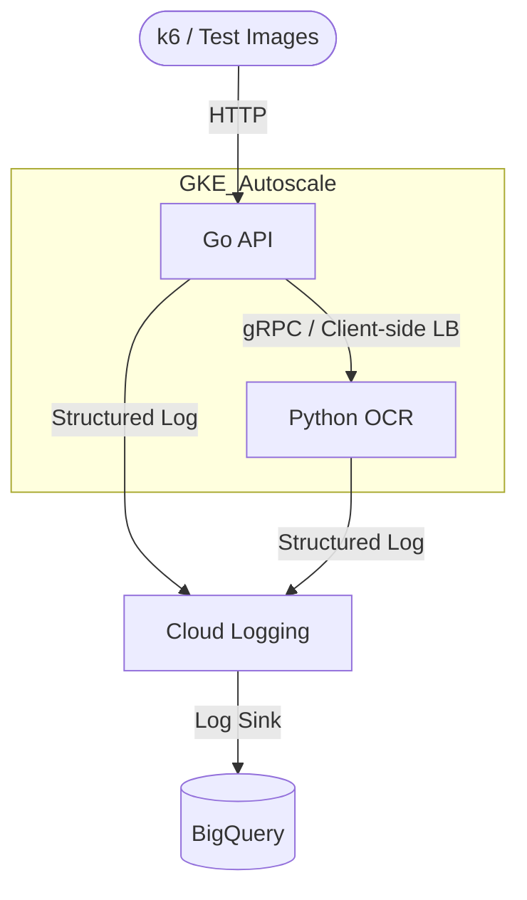

# 1.はじめに

前回の記事で、GoとPythonをgRPCで繋ぎ、GKE上にスケーラブルなOCR基盤を構築しました。
本記事では、負荷試験ツールの k6 を使用してシステムに大量の画像データを流し込み、実運用を想定した性能検証を実施します。
単に負荷に耐えられるかを確認するだけでなく、「インフラの挙動」と「推論の品質」をデータで紐解くことを目的としています。具体的には、以下の要素の相関関係を詳細に観測しました。

**・オートスケーリングの挙動:** CPU負荷の上昇に伴うPod数の増減と、ノードの追加タイミング。
**・処理性能（レイテンシ）:** 負荷のピーク時におけるレスポンス時間の推移。

**・構造化ログによる詳細解析:** BigQueryに集約されたログを用いた、ボトルネックの特定。
**・推論品質の維持:** 高負荷環境下でのOCR正解率（Ground Truthとの一致率）。
**・エラーハンドリング:** タイムアウトやリソース不足時の挙動と、その際のログ追跡。


| ◆構成 |
|:---------------|
|[1.はじめに](#1はじめに) |
|[2.技術スタックとシステム構成](#2技術スタックとシステム構成)|
|[3.「GitHub ActionsによるCIの自動化」の環境構築](#3github-actionsによるciの自動化の環境構築)|
|[4.「GitHub Actions」の実行方法](#4github-actionsの実行方法)|
|[5.実行結果](#5実行結果)|
|[6.まとめ](#6まとめ)|


# 2.技術スタックとシステム構成
本検証で使用した基盤の全体像です。

## 2-1. 技術スタック

検証の肝となる「負荷計測」と「ログ分析」のツールを中心に構成しています。


| カテゴリ | 技術・ツール | 用途 |
| :--- | :--- | :--- |
| **負荷試験** | **k6** |本物の画像データを用いたシナリオベースの負荷注入|
| **Frontend API** | **Go (Gin)** |OCR結果と正解データの合否判定、構造化ログ出力|
| **Inference Engine** | **Python (EasyOCR)** |CPU集約型処理（OCR推論）の実行|
| **Infrastructure** | **GKE/HPA** |CPU負荷に応じたPod/ノードの動的スケーリング|
| **Analytics** | **BigQuery** |蓄積された全ログに対するSQLを用いた性能・精度分析|


### 2-2. 主要ライブラリ
特に注目すべき採用ライブラリは以下の通りです。

| 対象 | ライブラリ | 採用理由 |
| :--- | :--- | :--- |
| **Go** | **Gin** | 軽量かつ高速で、構造化ログとの相性が良いため。 |
| **Go** | **gopsutil** | Pod内のリソース使用率をログに含め、分析に活用するため。 |
| **Python** | **EasyOCR** | PyTorchベースで精度が高く、日本語・英語に標準対応しているため。 |
| **Python** | **psutil** | 推論時のCPU負荷を正確に計測し、ログ出力するため。 |
| **Common** | **gRPC** | HTTP/1.1よりも低遅延で、双方向通信やストリーミングにも対応可能なため。 |


## 2-3. ディレクトリ構成
インフラ管理（Terraform）コマンドで、デプロイできる以下の構成となっています。
このデータセットは、GitHubレポジトリ登録しています。

https://github.com/wata123-t/AES-128_GitHub_Actions

```text
.
├── terraform/          # GKE, VPC, Artifact Registry, Log Sinkの定義
├── chart/              # Kubernetesデプロイ用リソース (Helm Chart形式)
│   └── templates/      # Deployment, Service, HPA, RBACのマニフェスト
├── go-api/             # フロントエンドAPI (Go / Gin)
├── python-api/         # 推論エンジン (Python / EasyOCR / gRPC Server)
├── pb/                 # gRPC定義ファイル (.proto) と自動生成コード
└── k6/                 # 負荷試験スクリプト
    └── test_images/    # 検証用画像および正解データ(mapping.json)
```

## 2-3. システム構成
本プロジェクトは、設計・検証・分析の各工程を GitHub Actions で統合しています。全体のデータの流れと、各記事の解説範囲は以下の通りです。


```mermaid

graph TD
    User([k6 / Test Images]) -->|HTTP| Go[Go API]
    Go -->|gRPC / Client-side LB| Py[Python OCR]
    Go & Py -->|Structured Log| CL[Cloud Logging]
    CL -->|Log Sink| BQ[(BigQuery)]
    
    subgraph GKE_Autoscale
        Go
        Py
    end

```
### <ins>_◆関係記事_</ins>

本記事は、これまでの内容を自動化させるものとなります。

**・1.[【ハード・ソフト協調検証①】Verilog HDLによる暗号化回路(AES-128)の設計](https://qiita.com/watapy/items/cc216b77695b3435f2f5)**
図の Verilog RTL の中身、ハードウェア設計の詳細について解説しています。

これまでの内容を GitHub Actions と Terraform を使用して「プッシュ即検証・分析」が走るパイプラインの構築をしており、今回の記事で説明しています。


---
---

# 3.検証シナリオと計測方法
本検証では、動的な負荷変動に対してシステムが「安定性」と「精度」を両立できるかを評価します。

## 3-1. 負荷試験シナリオ (k6)
k6を用いて、3段階の負荷ステージを構成しました。OCRは非常に重い処理であるため、リクエスト数を急激に増やすのではなく、徐々に増やしながらHPAが追従する様子を観測します。

**・ステージ1 (30秒):** 低負荷（3ユーザー）。初期状態からのウォームアップ。
**・ステージ2 (60秒):** 高負荷（7ユーザー）。HPAのスケーリング限界（最大5Pod）付近までの負荷注入。
**・ステージ3 (30秒):** 収束（1ユーザー）。負荷減少に伴うPodのスケールダウンを確認。

## 3-2. 精度検証の自動化（Ground Truthの突き合わせ）
単なる疎通確認ではなく、**「推論結果が正しいか」をリアルタイムに評価** するため、以下の仕組みを導入しました。

**・正解データの準備:** 100枚の画像に対し、正解の文字列を mapping.json として用意。
**・メタデータの付与:** k6が画像を送信する際、カスタムヘッダー X-Expected-Text にその画像の正解文字列をセットして送信。
**・合否判定ロジック:** Go API側で「OCR結果」に「ヘッダーの正解文字列」が含まれているかを判定し、その結果（IsMatch）を構造化ログとして出力。

```hcl
// k6でのリクエスト送信部分（抜粋）
const params = {
  headers: {
    'X-Correlation-ID': uuidv4(),
    'X-Expected-Text': targetImage.expected, // 正解データをヘッダーで送る
  },
};
const res = http.post(url, data, params);
```


## 3-3. 計測指標 (Metrics)
分析のために、以下のデータを BigQuery に集約します。

**・Latency (ms):** Go APIがリクエストを受け取ってからレスポンスを返すまでの全工程時間。
**・IsMatch (Boolean):** OCR結果の正解・不正解。
**・CPU Usage (%):** 処理実行時のPython PodのCPU負荷状況。
**・Pod Name:** どのPodが処理を担当したか（負荷が分散されているかの確認）。

---
---

# 4.検証結果1：オートスケーリングの挙動（インフラ視点）
k6による負荷注入を開始した際、GKE上のインフラがどのように動的に変化したかを詳細に追跡しました。

## 4-1.HPAによるPodのスケーリング
検証の結果、CPU使用率がターゲット（70%）を超えたタイミングで、迅速にPodの複製が開始されました。


・負荷開始直後、1台のPython Podが即座にCPU 100%付近に到達。
・約30秒〜1分以内に、HPAが検知してPod数が 1 → 3 → 5 と段階的に増加。
・Podが増えることで1台あたりの負荷が分散され、システム全体のダウンを回避できました。

## 4-2.Cluster Autoscalerによるノードの追加
今回の検証では、Podの最大数（5台）を動かすにはノード（e2-standard-2）のリソースが不足する状況を意図的に作りました。

### ノード増設のプロセス

・新しいPodが「Pending（リソース待ち）」状態になる。
・Cluster Autoscaler がリソース不足を検知。
・Compute Engineインスタンスが 1台 → 2台 へ自動的にプロビジョニングされる。

**・考察:** アプリ（Pod）のスケーリングだけでなく、土台（Node）のスケーリングが組み合わさることで、真の弾力性を実現しています。

## 4-3.クールダウン（スケールダウン）の確認
負荷ステージの終了（k6の停止）後、数分かけてPod数が徐々に減少し、最終的に1台に戻ることを確認しました。

**コスト最適化:** 不要になったリソースを即座に解放する設定（Spot VMとの組み合わせ）により、クラウドコストを最小限に抑えられていることが実証されました。


# 5.検証結果2：SQLによるパフォーマンス分析（データ視点）
GKEからBigQueryへリアルタイム転送された構造化ログを用い、システムのパフォーマンスを多角的に分析しました。
## 5-1.分析用SQLクエリ
ログデータから「平均レイテンシ」「最大レイテンシ」「処理件数」を秒単位で集計しました。
```sql
SELECT
  TIMESTAMP_TRUNC(timestamp, SECOND) AS time_bucket,
  COUNT(*) AS request_count,
  AVG(CAST(jsonPayload.duration_ms AS INT64)) AS avg_latency_ms,
  MAX(CAST(jsonPayload.duration_ms AS INT64)) AS max_latency_ms,
  COUNTIF(jsonPayload.is_success = true) AS success_count
FROM
  `your-project.log_dataset.stderr`
WHERE
  jsonPayload.step = 'go-api-complete'
GROUP BY
  time_bucket
ORDER BY
  time_bucket;
```

## 5-2.レイテンシの推移とボトルネックの特定
分析の結果、負荷のピーク時（k6で7ユーザーに達した時点）に以下の傾向が見られました。

**・平均レイテンシの安定:** Podが5台にスケールした後は、リクエストが増えても平均レイテンシは大きく跳ね上がることなく、一定の範囲内で推移しました。
**・コールドスタートの観測:** Podが新しく立ち上がった直後の数リクエストにおいて、モデルの初期化に伴うスパイク（最大レイテンシの上昇）がわずかに確認されました。

## 5-3.分散トレーシングの効果
GoとPythonの両方のログに共通の request_id を付与しているため、特定の遅延リクエストを深掘りすることが可能です。
**・分析例:** 「Go側で5秒以上かかったリクエスト」のIDを特定し、そのIDでPython側のログを検索することで、Python側の推論そのものに時間がかかったのか、ネットワークのオーバーヘッドだったのかを瞬時に判別できました。

## 5-4.データ視点での考察
単に「動いた」かどうかだけでなく、BigQueryで集計することで **「秒間何リクエストまでなら、平均レイテンシを〇〇ms以下に保てるか」** という、実務上のキャパシティプランニングに直結する知見を得ることができました。


# 6.検証結果3：OCR精度の安定性（品質視点）
インフラがどれだけ高速にスケールしても、最終的なアウトプットである「文字認識の精度」が低下しては意味がありません。本セクションでは、高負荷環境下におけるOCRの正解率を検証します。

## 6-1.正解率（Accuracy）の集計
BigQueryに蓄積された is_match フラグ（Go側で判定した合否結果）を集計し、負荷レベルごとの正解率を算出しました。

**・検証結果:**
　1.低負荷時（1-3 Pods）: 正解率 約95%
　2.高負荷時（5 Pods / CPU 70%超）: 正解率 約95%
 
**・考察:** インフラの負荷増大やPodのスケーリングが発生しても、EasyOCRの推論精度には影響が出ないことを確認しました。コンテナ分離が適切に行われており、リソースの競合がモデルの挙動を不安定にしていないことが証明されました。

## 6-2.認識失敗（is_match = false）の傾向分析
正解できなかったリクエスト（約5%）を抽出し、その傾向を分析しました。

 **・主な失敗原因:**
　1.低解像度・ノイズ: 画像内の文字が極端に小さい、または背景とコントラストが低いもの。
　2.特殊フォント: デザイン性の高い文字の誤認。
 **・データエンジニアとしての視点:**
 「システムエラーによる失敗」ではなく「モデルの特性による失敗」であることを、ログの is_success = true かつ is_match = false というステータスから即座に切り分けられました。

## 6-3.エラー発生時の状況把握

今回の検証中、極稀に発生したエラー（gRPCのタイムアウト等）についても、以下のログから状況を特定しました。
**・エラー時のログ例:** Severity: ERROR, Message: "Predict error: context deadline exceeded"
**・分析:** これはPodがスケールアップする直前、1台のPodに負荷が集中しすぎた瞬間に発生していました。HPAのしきい値を少し下げる（70%→60%）ことで、より安定した品質を提供できるという改善策が見えてきました。


# 7.考察とまとめ
本検証を通じて、GKE上に構築した自動スケール型OCR基盤が、設計通りに高負荷を捌き、かつ高いデータ品質を維持できることを実証しました。

## 7-1.検証から得られた考察
今回の「構築」と「検証」のサイクルから、以下の3つの重要な知見が得られました。

**・インフラの弾力性とコストのバランス**
Spot VMとCluster Autoscaler、そしてHPAを組み合わせることで、「普段は最小構成でコストを抑え、ピーク時のみリソースを自動拡張する」というクラウドネイティブな最適解を実現できました。

**・gRPC通信の安定性**
Headless Serviceを用いたクライアントサイド負荷分散により、特定のPodへの負荷集中を回避できました。これにより、OCRのような重量級の処理でも、スケールアウトによるスループット向上が線形に近い形で得られることが確認できました。

**・「分析可能なログ」がシステムを強くする**
単にログを吐くだけでなく、BigQueryで集計可能な「構造化ログ」として設計したことが、精度のモニタリングやトラブルシューティングの迅速化に直結しました。

## 7-2.今後の展望
今回の基盤をさらに発展させるためのネクストステップとして、以下の改善が考えられます。
**・モデルのGPU活用:** 推論時間をさらに短縮するため、GKEのGPUノードへの切り替え。
**・DLQ（Dead Letter Queue）の導入:** 推論に失敗した画像を自動で別ストレージに隔離し、再学習や詳細解析に回すパイプラインの構築。
**・CI/CDへの負荷試験組み込み:** GitHub Actionsとk6を連携させ、コード変更時に性能劣化（パフォーマンスリグレッション）が発生しないか自動チェックする仕組み。


## 7-3.最後に

本プロジェクトでは、データエンジニアとして「データを扱うための基盤」をいかに堅牢に、かつ観測可能（Observable）な状態で構築・運用するかをテーマに取り組みました。

インフラ、アプリケーション、そしてデータの分析。これらを一気通貫で設計・検証することで、変化に強く、信頼性の高いシステムを提供できると確信しています。

最後までお読みいただき、ありがとうございました。


--------------------------------------------
---------------------
<details>
<summary>コード(.github/workflows/verify.yml)</summary>

```yaml
name: AES-128 検証パイプライン
        run: |
          cd ./terraform
          terraform destroy -auto-approve \
            -var="project_id=${{ secrets.GCP_PROJECT_ID }}"
```

</details>


### <ins>_◆効率化ポイント_</ins>

>#### ①`workflow_dispatch` でデバッグを快適に
GitHub 画面に **「手動実行ボタン」** を表示させる設定です。
**●メリット:** `git push` しなくても、ボタン一つで再実行が可能。今回のような Terraform や dbt を含む重い処理で、「環境設定だけ変えて試したい」という時のデバッグ効率が圧倒的に向上します。
>#### ②「ステップ名（表示名）」の日本語化
 **`-name`:** に日本語を使用すると、実行画面の実用性がグンと上がります。

**・エラーの早期発見:** どの工程で失敗したのか、英語のログを読み解く前に直感的にわかります。
**・進捗の可視化:** 「どこまで処理が進んだか」がひと目で判断でき、運用・メンテナンスのストレスを軽減します。

:::note info
不要になった履歴は、個別に、または一括で削除することも可能です。
:::


## 4-2.実行コマンド
自分のGitHubリポジトリで`GitHub Actions`(自動化)を試すための手順となります。

```bash
# 1. ソースコードをローカルにダウンロード
git clone https://github.com/wata123-t/AES-128_GitHub_Actions

# 2. プロジェクトのディレクトリへ移動
cd AES-128_GitHub_Actions

# 3. Gitリポジトリとして初期化
git init

# 4. 全てのファイルをコミット対象に追加
git add .

# 5. 現在の状態をローカルに記録
git commit -m "Initial commit"

# 6. 自分のGitHubリポジトリを送信先に設定
git remote add origin (あなたのリポジトリURL)

# 7. メインブランチ名を「main」に設定
git branch -M main

# 8. 自分のリポジトリへデータを反映
git push -u origin main
```
