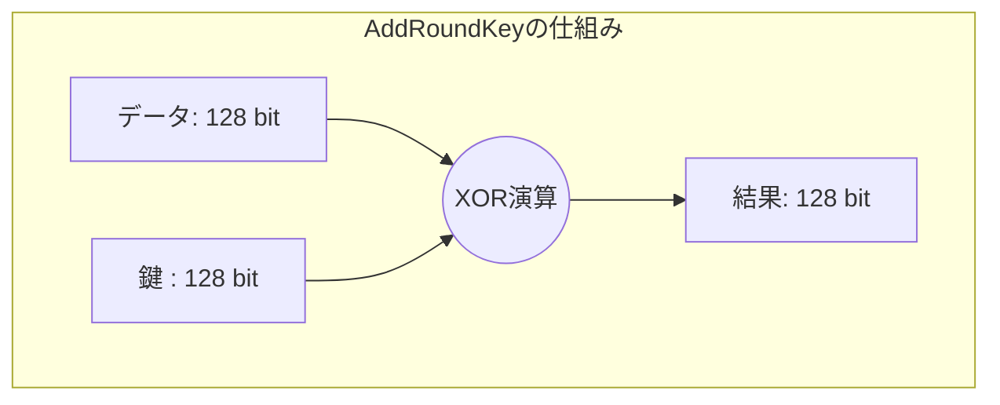

# 1.はじめに

本記事では、共通鍵暗号方式のデファクトスタンダードである「AES-128」を題材に、Verilog HDLを用いたハードウェア設計について解説します。
本内容は、先に公開した記事 **『AES-128 設計を GitHub Actions で自動化：BigQueryとdbtを使用したデータ解析』** における作業内容をより深掘りし、設計の詳細を説明するために用意しました。


| ◆構成 |
|:---------------|
|[1.はじめに](#1はじめに) |
|[2.ファイル構成](#2ファイル構成)|
|[3.AES-128 アルゴリズムの概要](#3aes-128-アルゴリズムの概要)|
|[4.ブロック構成](#4ブロック構成)|
|[5.シミュレーションによる動作確認](#5シミュレーションによる動作確認)|
|[5.Verilogのソースコード](#5verilogのソースコード)|
|[6.Simulation実行方法](#6simulation実行方法)|
|[7.波形確認](#7波形確認)|
|[8.まとめ](#8まとめ)|

# 2.ファイル構成

このデータセットは、GitHubレポジトリ登録しています。
https://github.com/wata123-t/AES-128_GitHub_Actions

```text
.
├── .github/workflows/   # CI/CD設定（GitHub Actions）
├── docker/              # ツール一式（Verilog/Python）のコンテナ定義
├── python/              # 期待値生成・検証用Pythonスクリプト
├── verilog/             # AES-128暗号化回路（RTL）
├── aes_dbt/             # データ変換・管理
├── terraform/           # インフラ定義
├── Makefile             # 実行コマンドのラッパー
└── README.md            # セットアップ手順

```
この記事内で使用しているのは、ディレクトリ`verilog`内の、以下のファイルとなります。

|ファイル名|概要|
|:----|:----|
|[aes_128.v](#5-1-ブロックakaes_128)|TOPモジュール|
|[aes_round_logic.v](#5-2-ブロックaes_round_logic)|1ラウンド分の処理をまとめたコアロジック|
|[key_expansion.v](#5-3-ブロックkey_expansion)|128bitの初期鍵から各ラウンド用の拡張鍵を生成するブロック|
|[mixcolumns.v](#5-4-ブロックmixcolumns)|列単位の行列演算を行う拡散処理ブロック|
|[sbox.v](#5-5-ブロックsbox)|SubBytes用の置換テーブル|
|[shiftrows.v](#5-6-ブロックshiftrows)|	行単位のデータ入れ替え機能ブロック|
|[tb_aes_128.v](#5-7-ブロックtb_aes_128)|機能検証用のテストベンチ|
|docker-compose.yml|シミュレーション実行環境をコンテナ化する設定ファイル|


# 3.AES-128 アルゴリズムの概要

ハードウェア化するにあたって理解しておくべき、AES-128の処理フローを整理します。

## 3-1.基本仕様
AES (Advanced Encryption Standard) は、データの暗号化と復号に共通の鍵を用いる「共通鍵暗号」の標準規格です。128ビット単位で処理を行います。


**データブロック長:** 128ビット（16バイト）
**共通鍵の長さ:** 128ビット
**ラウンド数:** 10ラウンド（初期変換 + 9ラウンド + 最終ラウンド）
**出力データ:** 128ビット（暗号文）


## 3-2.ラウンド演算
入力データに対する演算方法に関して説明します。(鍵データに関して省略します。)
各ラウンドでは以下の4つの処理（ステップ）を順次実行してデータを拡散・撹乱します。

|演算種類|説明|
|:----|:----|
|SubBytes|S-Boxと呼ばれる変換表を用いて、1バイト毎に値を置換え|
|ShiftRows|4x4行列の行単位でデータを巡回シフトし、データの位置を入替え|
|MixColumns|列単位で行列演算を行い、データを複雑に混合わせる|
|AddRoundKey|生成したラウンド鍵とデータの排他的論理和 (XOR) を取る


>#### ① 入力データ(128bit)の「4x4行列」への変換
入力データ(128bit)を以下の様な「4x4行列」に見立て、演算処理を実施します。
128bitデータを、8bit(1byte)×16個(S0～S15)に分割します。 


この様に分割したものを、以下の「4x4行列」として扱います。


>#### ② SubBytes(置換)
S0～S15 の各8bitデータに対して、**「S-Box(エス・ボックス)」** と呼ばれる変換表を用いて値の置き換えを行います。
8bitの入力（0x00～0xFFの256パターン）に対して、一対一で対応する別の8bit値へ変換します。
#### ●変換の例:
・`0x00` → `0x63`
・`0x01` → `0x7c`
・...
・`0xFF` → `0x16`

>#### ③ ShiftRows(行の入替え)
4x4行列の「行（Row）」に注目し、行ごとに決められた数だけ左方向に巡回シフト（ローテート）を行います。
**・0行目：** シフトしない
**・1行目：** 左に 1バイト シフト
**・2行目：** 左に 2バイト シフト
**・3行目：** 左に 3バイト シフト


>#### ④ MixColumns(列の混同)
4x4行列の **「列（Column）」** 単位で複雑な行列演算を行い、データをさらに攪拌（かくはん）します。
1列（32bit）をひとかたまりとして扱い、特定の定数行列を掛け合わせることで、 **「1バイトの変化を列全体の4バイトに波及させる（拡散）」** のが目的です。
※最終ラウンドのみ、この処理をスキップします。


1列目の変換は、以下の式となります。


2列目～4列目も同様に変換します。

>#### ⑤ AddRoundKey(鍵加算)
各ラウンドの最後に、暗号化スケジュールによって生成された **ラウンド鍵** と、現在のステート（データ）の間で **排他的論理和（XOR）** 演算を行います。
これにより、データが鍵の情報と直接合成されます。AESにおいて **「秘密鍵」の要素が唯一混入するステップ** であり、暗号化の本質を担う非常に重要な工程です。




# 4.ブロック構成

主要モジュールの簡易構成図を示します。


# 5.Verilogのソースコード
作成したVerilogコードに関して簡易の概要説明を行っています。


## 5-1. ブロック「akaes_128」
最上位モジュール「aes_128」となります。

<details>
<summary>コード(akaes_128.v)</summary>

```verilog
module aes_128 (
	input	wire			clk ,
	input	wire			rst ,
	input	wire			start ,
	input	wire	[127:0]	plaintext ,		// 暗号化したいデータ
	input	wire	[127:0]	key ,			// 128ビット鍵
	output	reg		[127:0]	ciphertext ,	// 暗号化後のデータ
	output	reg				done			// 完了フラグ
);

 wire	[127:0]		sub_out ;
 wire	[127:0]		shift_out ;
 wire	[127:0]		mix_out ;
 wire	[127:0]		next_key_out ;

 reg	[3:0]		round_count ;
 reg	[127:0]		round_key_reg ;
 reg	[127:0]		aes_data ;
 reg				round_en ;
 wire				end_flg ;
 wire				out_en ;
 wire				pre_end_flg ;


aes_round_logic round_unit (
	 . state_in			( aes_data	)
	,. is_last_round	( end_flg	)
	,. state_out		( mix_out	)
) ;

key_expansion KE (
	 . round			( round_count	)   
	,. prev_key			( round_key_reg	) 
	,. next_key			( next_key_out	)
) ;


always @(posedge clk or posedge rst) begin
	if (rst)            			aes_data  <= 128'h0 ;
	else if(start)      			aes_data  <= plaintext ;
	else if(round_en) begin
		if(round_count==4'h0)		aes_data  <= aes_data ^ round_key_reg ;	// Round 0
		else						aes_data  <= mix_out  ^ round_key_reg ;	// Round 1-A
	end
end

always @(posedge clk or posedge rst) begin
	if (rst)				round_key_reg  <= 128'h0 ;
	else if(start)			round_key_reg  <= key ;
	else if(round_en) 		round_key_reg  <= next_key_out ;
end

always @(posedge clk or posedge rst) begin
	if (rst)				round_en  <= 1'b0 ;
	else if(start)			round_en  <= 1'b1 ;
	else if(end_flg)		round_en  <= 1'b0 ;
end

always @(posedge clk or posedge rst) begin
	if (rst)			round_count  <= 4'h0 ;
	else if(round_en)	round_count  <= round_count + 1'b1 ;
	else				round_count  <= 4'h0 ;
end

assign end_flg	= ( round_count == 4'hA )? 1'b1 : 1'b0 ;
assign out_en	= ( round_count == 4'hB )? 1'b1 : 1'b0 ;

always @(posedge clk or posedge rst) begin
	if (rst)			done  <= 1'b0 ;
	else				done  <= out_en ;
end

always @(posedge clk or posedge rst) begin
	if (rst)			ciphertext <= 128'h0 ;
	else if(out_en)		ciphertext <= aes_data ;
end

endmodule

```
</details>

## 5-2. ブロック「aes_round_logic」
1ラウンド内の演算処理（SubBytes, ShiftRows, MixColumns）を、ひとまとめにしています。

このブロックの特徴としては、以下の通りです。
**1.SubBytesの並列化:**
→128ビットのデータを8ビットに分割し、16個の「S-Box」で並列処理を実施
**2.最終ラウンドの切り替え:** 
→AESの仕様に基づき、最終ラウンドのみ MixColumns をスキップ
**3.組み合わせ回路としての構成:** 
→このモジュールはレジスタを持たない組み合わせ回路として構成

<details>
<summary>コード(aes_round_logic.v)</summary>

```verilog
module aes_round_logic (
	input	[127:0]	state_in ,
	input	[127:0]	round_key ,
	input			is_last_round ,
	output	[127:0]	state_out
);

 wire	[127:0]	sb_out ;
 wire	[127:0]	sr_out ;
 wire	[127:0]	mc_out ;

// 1. SubBytes (S-Boxを16個並列に並べる)
genvar i;
generate
	for (i = 0; i < 16; i = i + 1) begin : sb_loop
		sbox sb_inst (
			 .a	( state_in[i*8 +: 8]	)
			,.q	( sb_out[i*8 +: 8]		)
		);
	end
endgenerate

// 2. ShiftRows
shiftrows sr_inst (
	 . state_in		( sb_out )
	,. state_out	( sr_out )
);

// 3. MixColumns
mixcolumns mc_inst (
	 . state_in		( sr_out )
	,. state_out	( mc_out )
);

// 4. AddRoundKey (XOR)
assign state_out = (is_last_round)? sr_out : mc_out ;

endmodule

```
</details>

## 5-3. ブロック「key_expansion」
128ビットの初期鍵から各ラウンドで使用する10回分の「拡張鍵」を動的に生成します。

<details>
<summary>コード(key_expansion.v)</summary>

```verilog
module key_expansion (
    input  [3:0]   round,        // 現在のラウンド番号 (0-10)
    input  [127:0] prev_key,     // 1つ前のラウンドキー
    output [127:0] next_key      // 次のラウンドキー
);

    wire [31:0] w0, w1, w2, w3;
    assign {w0, w1, w2, w3} = prev_key;

    // 特殊な加工を行うワード (g関数)
    wire [31:0] g_out;
    wire [31:0] rot_w = {w3[23:0], w3[31:24]}; // RotWord
    
    // SubWord (S-Boxを4つ並列で使用)
    wire [31:0] sub_w;
    sbox sb0(.a(rot_w[31:24]), .q(sub_w[31:24]));
    sbox sb1(.a(rot_w[23:16]), .q(sub_w[23:16]));
    sbox sb2(.a(rot_w[15:8]),  .q(sub_w[15:8]));
    sbox sb3(.a(rot_w[7:0]),   .q(sub_w[7:0]));

    // Rcon (ラウンド定数)
    reg [7:0] rcon;
    always @(*) begin
        case(round)
            4'd0: rcon = 8'h01; // Round 0 の鍵から Round 1 の鍵を作るとき
            4'd1: rcon = 8'h02; // Round 1 の鍵から Round 2 の鍵を作るとき
            4'd2: rcon = 8'h04;
            4'd3: rcon = 8'h08;
            4'd4: rcon = 8'h10;
            4'd5: rcon = 8'h20;
            4'd6: rcon = 8'h40;
            4'd7: rcon = 8'h80;
            4'd8: rcon = 8'h1b;
            4'd9: rcon = 8'h36;
    default: rcon = 8'h00;
        endcase
    end

    assign g_out = sub_w ^ {rcon, 24'b0};

    // 新しい4つのワードを生成
    wire [31:0] next_w0 = w0 ^ g_out;
    wire [31:0] next_w1 = w1 ^ next_w0;
    wire [31:0] next_w2 = w2 ^ next_w1;
    wire [31:0] next_w3 = w3 ^ next_w2;

    assign next_key = {next_w0, next_w1, next_w2, next_w3};

endmodule

```
</details>

## 5-4. ブロック「mixcolumns」

列単位でのデータ拡散を行う、AESの中で最も計算負荷が高いモジュールです。
行列演算をハードウェアで効率的に実現しています。

<details>
<summary>コード(mixcolumns.v)</summary>

```verilog
module mixcolumns (
    input  [127:0] state_in,
    output [127:0] state_out
);
    //
    // 2倍 (xtime) と 3倍 (xtime ^ 原形) を計算する関数
    function [7:0] xtime;
        input [7:0] a;
        begin
            // MSBが1なら左シフトして0x1bとXOR、0なら単に左シフト
            xtime = (a[7]) ? ((a << 1) ^ 8'h1b) : (a << 1);
        end
    endfunction

    // 各列（32ビットずつ）をバラして処理するための変数を生成
    genvar i;
    generate
        for (i = 0; i < 4; i = i + 1) begin : col_loop
            // 列の4バイトを抽出 (a0-a3)
            wire [7:0] a0 = state_in[127 - (i*32 + 0)  -: 8];
            wire [7:0] a1 = state_in[127 - (i*32 + 8)  -: 8];
            wire [7:0] a2 = state_in[127 - (i*32 + 16) -: 8];
            wire [7:0] a3 = state_in[127 - (i*32 + 24) -: 8];

            // 各バイトの新値を計算 (行列演算)
            // b0 = (2*a0) ^ (3*a1) ^ a2 ^ a3
            // b1 = a0 ^ (2*a1) ^ (3*a2) ^ a3
            // b2 = a0 ^ a1 ^ (2*a2) ^ (3*a3)
            // b3 = (3*a0) ^ a1 ^ a2 ^ (2*a3)

            assign state_out[127 - (i*32 + 0)  -: 8] = xtime(a0) ^ (xtime(a1) ^ a1) ^ a2 ^ a3;
            assign state_out[127 - (i*32 + 8)  -: 8] = a0 ^ xtime(a1) ^ (xtime(a2) ^ a2) ^ a3;
            assign state_out[127 - (i*32 + 16) -: 8] = a0 ^ a1 ^ xtime(a2) ^ (xtime(a3) ^ a3);
            assign state_out[127 - (i*32 + 24) -: 8] = (xtime(a0) ^ a0) ^ a1 ^ a2 ^ xtime(a3);

        end
    endgenerate

endmodule

```
</details>

## 5-5. ブロック「sbox」
S-Boxと呼ばれる変換表を用いて、1バイト毎に値を置換えます。


<details>
<summary>コード(sbox.v)</summary>

```verilog
module sbox (
    input  [7:0] a,
    output [7:0] q
);
    // 256エントリ x 8ビット = 2048ビットの巨大定数
    // 下位(右側)から 0x00, 0x01... と並べています
    localparam [2047:0] SBOX_DATA = {
	8'h16, 8'hBB, 8'h54, 8'hB0, 8'h0F, 8'h2D, 8'h99, 8'h41, 8'h68, 8'h42, 8'hE6, 8'hBF, 8'h0D, 8'h89, 8'hA1, 8'h8C, // [F0-FF]
	8'hDF, 8'h28, 8'h55, 8'hCE, 8'hE9, 8'h87, 8'h1E, 8'h9B, 8'h94, 8'h8E, 8'hD9, 8'h69, 8'h11, 8'h98, 8'hF8, 8'hE1, // [E0-EF]
	8'h9E, 8'h1D, 8'hC1, 8'h86, 8'hB9, 8'h57, 8'h35, 8'h61, 8'h0E, 8'hF6, 8'h03, 8'h48, 8'h66, 8'hB5, 8'h3E, 8'h70, // [D0-DF]
	8'h8A, 8'h8B, 8'hBD, 8'h4B, 8'h1F, 8'h74, 8'hDD, 8'hE8, 8'hC6, 8'hB4, 8'hA6, 8'h1C, 8'h2E, 8'h25, 8'h78, 8'hBA, // [C0-CF]
	8'h08, 8'hAE, 8'h7A, 8'h65, 8'hEA, 8'hF4, 8'h56, 8'h6C, 8'hA9, 8'h4E, 8'hD5, 8'h8D, 8'h6D, 8'h37, 8'hC8, 8'hE7, // [B0-BF]
	8'h79, 8'hE4, 8'h95, 8'h91, 8'h62, 8'hAC, 8'hD3, 8'hC2, 8'h5C, 8'h24, 8'h06, 8'h49, 8'h0A, 8'h3A, 8'h32, 8'hE0, // [A0-AF]
	8'hDB, 8'h0B, 8'h5E, 8'hDE, 8'h14, 8'hB8, 8'hEE, 8'h46, 8'h88, 8'h90, 8'h2A, 8'h22, 8'hDC, 8'h4F, 8'h81, 8'h60, // [90-9F]
	8'h73, 8'h19, 8'h5D, 8'h64, 8'h3D, 8'h7E, 8'hA7, 8'hC4, 8'h17, 8'h44, 8'h97, 8'h5F, 8'hEC, 8'h13, 8'h0C, 8'hCD, // [80-8F]
	8'hD2, 8'hF3, 8'hFF, 8'h10, 8'h21, 8'hDA, 8'hB6, 8'hBC, 8'hF5, 8'h38, 8'h9D, 8'h92, 8'h8F, 8'h40, 8'hA3, 8'h51, // [70-7F]
	8'hA8, 8'h9F, 8'h3C, 8'h50, 8'h7F, 8'h02, 8'hF9, 8'h45, 8'h85, 8'h33, 8'h4D, 8'h43, 8'hFB, 8'hAA, 8'hEF, 8'hD0, // [60-6F]
	8'hCF, 8'h58, 8'h4C, 8'h4A, 8'h39, 8'hBE, 8'hCB, 8'h6A, 8'h5B, 8'hB1, 8'hFC, 8'h20, 8'hED, 8'h00, 8'hD1, 8'h53, // [50-5F]
	8'h84, 8'h2F, 8'hE3, 8'h29, 8'hB3, 8'hD6, 8'h3B, 8'h52, 8'hA0, 8'h5A, 8'h6E, 8'h1B, 8'h1A, 8'h2C, 8'h83, 8'h09, // [40-4F]
	8'h75, 8'hB2, 8'h27, 8'hEB, 8'hE2, 8'h80, 8'h12, 8'h07, 8'h9A, 8'h05, 8'h96, 8'h18, 8'hC3, 8'h23, 8'hC7, 8'h04, // [30-3F]
	8'h15, 8'h31, 8'hD8, 8'h71, 8'hF1, 8'hE5, 8'hA5, 8'h34, 8'hCC, 8'hF7, 8'h3F, 8'h36, 8'h26, 8'h93, 8'hFD, 8'hB7, // [20-2F]
	8'hC0, 8'h72, 8'hA4, 8'h9C, 8'hAF, 8'hA2, 8'hD4, 8'hAD, 8'hF0, 8'h47, 8'h59, 8'hFA, 8'h7D, 8'hC9, 8'h82, 8'hCA, // [10-1F]
	8'h76, 8'hAB, 8'hD7, 8'hFE, 8'h2B, 8'h67, 8'h01, 8'h30, 8'hC5, 8'h6F, 8'h6B, 8'hF2, 8'h7B, 8'h77, 8'h7C, 8'h63  // [00-0F]
    };

    // a * 8 を起点に 8ビット分を抽出  ( a=0 の時は　[7:0] )
    assign q = SBOX_DATA[a * 8 +: 8];

endmodule

```
</details>

---
## 5-6. ブロック「shiftrows」

4x4の行列と見なしたデータに対し、行ごとに異なる量の巡回シフト(スライド)を行います。


<details>
<summary>コード(shiftrows.v)</summary>

```verilog
module shiftrows (
    input  [127:0] state_in,
    output [127:0] state_out
);
    // 第0行 (変化なし) : s0, s4, s8, s12
    assign state_out[127:120] = state_in[127:120]; // s0
    assign state_out[95:88]   = state_in[95:88];   // s4
    assign state_out[63:56]   = state_in[63:56];   // s8
    assign state_out[31:24]   = state_in[31:24];   // s12

    // 第1行 (1バイト左回転) : s1, s5, s9, s13
    assign state_out[119:112] = state_in[87:80];   // s1  <- s5
    assign state_out[87:80]   = state_in[55:48];   // s5  <- s9
    assign state_out[55:48]   = state_in[23:16];   // s9  <- s13
    assign state_out[23:16]   = state_in[119:112]; // s13 <- s1

    // 第2行 (2バイト左回転) : s2, s6, s10, s14
    assign state_out[111:104] = state_in[47:40];   // s2  <- s10
    assign state_out[79:72]   = state_in[15:8];    // s6  <- s14
    assign state_out[47:40]   = state_in[111:104]; // s10 <- s2
    assign state_out[15:8]    = state_in[79:72];   // s14 <- s6

    // 第3行 (3バイト左回転) : s3, s7, s11, s15
    assign state_out[103:96]  = state_in[7:0];     // s3  <- s15
    assign state_out[71:64]   = state_in[103:96];  // s7  <- s3
    assign state_out[39:32]   = state_in[71:64];   // s11 <- s7
    assign state_out[7:0]     = state_in[39:32];   // s15 <- s11

endmodule

```
</details>

---
## 5-7. ブロック「tb_aes_128」
検証用のテストベンチです

<details>
<summary>コード(tb_aes_128.v)</summary>

```verilog
`timescale 1ns / 1ps

module tb_aes_128();

    reg clk;
    reg rst;
    reg start;
    reg  [127:0] plaintext;
    reg  [127:0] key;
    wire [127:0] ciphertext;
    wire         done;
    reg [15:0] STEP_CHK ;

    // AES-128 トップモジュールのインスタンス化
    aes_128 uut_1 (
        .clk(clk),
        .rst(rst),
        .start(start),
        .plaintext(plaintext),
        .key(key),
        .ciphertext(ciphertext),
        .done(done)
    );


    // クロック生成 (100MHz)
    always #5 clk = ~clk;

    initial begin
        STEP_CHK=16'hA5A2 ;
        $dumpfile("aes_test.vcd"); // 波形データの保存先
        $dumpvars(0, tb_aes_128);  // すべての信号を記録

        // --- 初期化 ---
        clk = 0;
        rst = 1;
        start = 0;
        plaintext = 0;
        key = 0;

        // リセット解除
        #20 rst = 0;
        
        #10;
        // --- テストケース1 (NIST FIPS 197 公式例) ---
        plaintext = 128'h00112233445566778899aabbccddeeff;
        key       = 128'h000102030405060708090a0b0c0d0e0f;
        start = 1;
        #10 start = 0;
        #10000 ;
        #10;
        $display("--- AES-128 Simulation Result ---");
        $display("Plaintext:  %h", plaintext);
        $display("Key:        %h", key);
        $display("Result:     %h", ciphertext);
        $display("Expected:   69c4e0d86a7b0430d8cdb78070b4c55a");

        if (ciphertext == 128'h69c4e0d86a7b0430d8cdb78070b4c55a)
            $display("Test Passed!");
        else
            $display("Test Failed...");

        #50 $finish;
    end

endmodule

```
</details>


# 6.Simulation実行方法

Docker環境をインストールしている事が必要となります。

```bash
# 1. ディレクトリ「./verilog」に移動
cd ./verilog

# 2. コンテナをバックグラウンドで起動(docker-compose.yml)
docker-compose up -d

# 3. 起動中の verilog コンテナ内に入る
docker-compose exec verilog bash

# 4. シミュレーションに必要なツールをインストール
apt-get update && apt-get install -y iverilog

# 5. 全Verilog ファイル(.v)を読み込み、コンパイルして実行バイナリを生成
iverilog -o aes_sim *.v

# 6. Simulation 実行
vvp aes_sim
```


# 7.波形確認
Simulation 結果は、`aes_test.vcd`ファイルとして出力して、波形表示ツール`GTKWave`で観測すると以下の様な感じになります。
ここでは主要な信号の部分的な動きのみの表示となっています。


本来の設計では、多数のパターンを使用した詳細確認を実施しますが、今回は1パターンの結果が一致した時点で終了としています。


# 8.まとめ
本業のハードウェア検証では高価な商用シミュレータを使用していますが、かつては個人レベルで同等の検証環境を揃えるのはほぼ不可能に近いことでした。
しかし現在では、 **OSS（オープンソースソフトウェア）の発展により、個人でも商用ツールに引けを取らない高機能なシミュレーション環境が手に入ります。**
さらにDockerを活用することで、複雑な依存関係に悩まされることなく、極めて短時間で環境構築を完了できる点に、技術の進歩と大きな利便性を実感しました。

