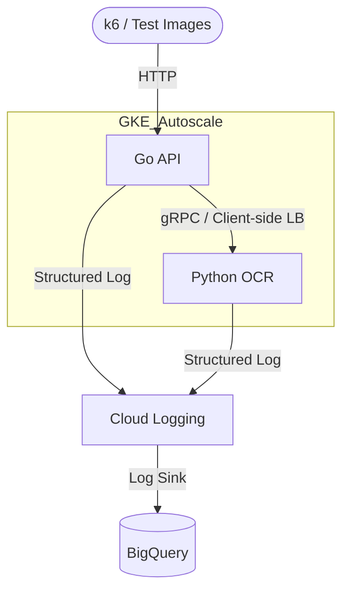

# 1.はじめに

[構築編](リンク)では、GoとPythonをgRPCで繋いだGKE上のサイドカー構成OCR基盤について解説しました。
検証編となる本記事では、負荷試験ツール k6 を用い、実運用を見据えた「性能」と「信頼性」の検証を行います。
単なる負荷耐性の確認に留まらず、**「インフラの拡張性が、推論品質と処理速度にどう直結するか」** をBigQueryに集約された膨大な実ログをベースに、以下の4つの視点で解き明かします。


**・スケーラビリティの証明**
Pod増減に伴うスループット（TPS）の変化を定量的に測定。
**・高負荷環境下での精度評価**
テスト画像と期待値を照合し、リソース逼迫時でも演算精度が損なわれないかを検証。
**・内部構造の解析**
BigQueryに集約した構造化ログを用い、Go(受付) / Python(推論) 各レイヤーの滞在時間をミリ秒単位で分解・可視化。
**・分散トレーシングの追跡**
Correlation IDをキーに、リクエストから推論完了までの一連の流れを可視化。

★全体の設計思想や背景については、まず以下の記事をご一読ください。
・具体的な実装・コードについては： [詳細説明編]（リンク）
・設計ポイント解説： [ポイント説明編]（リンク）


| ◆構成 |
|:---------------|
|[1.はじめに](#1はじめに) |
|[2.技術スタックとシステム構成](#2技術スタックとシステム構成)|
|[3.検証環境と計測手法](#3検証環境と計測手法)|
|[4.検証結果1：基本性能（1 Pod / VU=1）](#4検証結果1基本性能1-pod--vu1)|
|[5.検証結果2：限界性能の特定（垂直負荷への限界）](#5検証結果2限界性能の特定垂直負荷への限界)|
|[6.検証結果3：水平スケーリングによる解決（スケーラビリティの証明）](#6検証結果3水平スケーリングによる解決スケーラビリティの証明)|
|[7.POD構成の検討と今後の課題](#7POD構成の検討と今後の課題)|
|[8.考察とまとめ](#8考察とまとめ)|


# 2.技術スタックとシステム構成
本検証で使用した基盤の全体像です。

## 2-1. 技術スタック

検証の肝となる「負荷計測」と「ログ分析」のツールを中心に構成しています。


| カテゴリ | 技術・ツール | 用途 |
| :--- | :--- | :--- |
| **負荷試験** | **k6** |本物の画像データを用いたシナリオベースの負荷注入|
| **Frontend API** | **Go (Gin)** |OCR結果と正解データの合否判定、構造化ログ出力|
| **Inference Engine** | **Python (EasyOCR)** |CPU集約型処理（OCR推論）の実行|
| **Infrastructure** | **GKE/HPA** |CPU負荷に応じたPod/ノードの動的スケーリング|
| **Analytics** | **BigQuery** |蓄積された全ログに対するSQLを用いた性能・精度分析|


### 2-2. 主要ライブラリ
特に注目すべき採用ライブラリは以下の通りです。

| 対象 | ライブラリ | 採用理由 |
| :--- | :--- | :--- |
| **Go** | **Gin** | 軽量かつ高速で、構造化ログとの相性が良いため。 |
| **Go** | **gopsutil** | Pod内のリソース使用率をログに含め、分析に活用するため。 |
| **Python** | **EasyOCR** | PyTorchベースで精度が高く、日本語・英語に標準対応しているため。 |
| **Python** | **psutil** | 推論時のCPU負荷を正確に計測し、ログ出力するため。 |
| **Common** | **gRPC** | HTTP/1.1よりも低遅延で、双方向通信やストリーミングにも対応可能なため。 |


## 2-3. ディレクトリ構成
インフラ管理（Terraform）コマンドで、デプロイできる以下の構成となっています。
このデータセットは、GitHubレポジトリ登録しています。

https://github.com/wata123-t/go-python-easyocr-gke

```text
.
├── terraform/          # GKE, VPC, Artifact Registry, Log Sinkの定義
├── chart/              # Kubernetesデプロイ用リソース (Helm Chart形式)
│   └── templates/      # Deployment, Service, HPA, RBACのマニフェスト
├── go-api/             # フロントエンドAPI (Go / Gin)
├── python-api/         # 推論エンジン (Python / EasyOCR / gRPC Server)
├── pb/                 # gRPC定義ファイル (.proto) と自動生成コード
└── k6/                 # 負荷試験スクリプト
    └── test_images/    # 検証用画像および正解データ(mapping.json)
```

## 2-3. システム構成
本プロジェクトは、設計・検証・分析の各工程を GitHub Actions で統合しています。全体のデータの流れと、各記事の解説範囲は以下の通りです。


```mermaid

graph TD
    User([k6 / Test Images]) -->|HTTP| Go[Go API]
    Go -->|gRPC / Client-side LB| Py[Python OCR]
    Go & Py -->|Structured Log| CL[Cloud Logging]
    CL -->|Log Sink| BQ[(BigQuery)]
    
    subgraph GKE_Autoscale
        Go
        Py
    end

```
### <ins>_◆関係記事_</ins>

本記事で検証している内容は、以下を参照して下さい。

**・1.[(zzzzz)スケーラブルなOCR基盤(Go×Python×EasyOCR×GKE)に関する詳細説明](https://qiita.com/watapy/items/cc216b77695b3435f2f5)**

**・2.[(zzzzz)スケーラブルなOCR基盤(Go×Python×EasyOCR×GKE)の構築](https://qiita.com/watapy/items/cc216b77695b3435f2f5)**

# 3.検証環境と計測手法
本システムの実効性を証明するため、負荷試験ツール k6 を活用し、「システムパフォーマンス」と「推論精度」の両面から徹底的な検証を行いました。

## 3-1. テストフェーズと手順
段階的に負荷を引き上げ、リソースの飽和（エルボーポイント）とスケーラビリティを確認します。

**・Phase 1：ベースライン測定（VU: 1）**
インフラへの負荷が最小の状態で、1枚あたりの「理論上の最大性能」を測定。
**・Phase 2：垂直限界の特定（VUs: 3 ～ 5）**
1 Pod構成のまま同時接続数を増やし、待ち行列が発生し始める「限界点」を観測。
**・Phase 3：水平スケーリング検証（VUs: 5 ～ 30）**
Pod数を拡張（3 Pods / 5 Pods）し、インフラ増強によるスループットの線形向上を確認。

**・負荷シナリオ:**
100枚のテスト画像をループで送信し、各フェーズ10分間の安定負荷を注入。一時的なスパイクではなく、継続的な負荷に対する安定性を評価します。

<details>
<summary>k6 で実行する`JavaScript`(./k6/script.js)</summary>

```js
import http from 'k6/http';
import { check, sleep } from 'k6';
//import { uuidv4 } from 'https://jslib.k6.io/k6-utils/1.4.0/index.js';
import { uuidv4 } from './k6-utils.js';


// 1. Pythonが作った正解リスト(JSON)を読み込む
const mapping = JSON.parse(open('./test_images/mapping.json'));
const imageFiles = [];

// 2. 100枚の画像をメモリに読み込む
for (let i = 1; i <= 100; i++) {
  const filename = `${String(i).padStart(3, '0')}.png`;
  
  imageFiles.push({
    name: filename,
    expected: mapping[filename], // JSONから正解を取得
    bin: open(`./test_images/${filename}`, 'b')
  });
}


export default function () {
  const url = 'http://35.221.115.130:8080/predict';
  
  // ★ 4. 順番に1枚選ぶ (0, 1, 2... 99, 0, 1...)
  // execution.instance.iterationInTest を使う方法もありますが、簡易的には __ITER を使用します
  const index = __ITER % imageFiles.length; 
  const targetImage = imageFiles[index];

  const data = {
    image: http.file(targetImage.bin, targetImage.name, 'image/png'),
  };

  const k6SendTime = Date.now();

  const params = {
    headers: {
      'X-Correlation-ID': uuidv4(),
      'X-Expected-Text': targetImage.expected,
      'X-K6-Send-Time': k6SendTime.toString(),
      'X-Image-Index': index.toString(), // デバッグ用に何番目か送るのもアリ
    },
  };

  const res = http.post(url, data, params);

  // （以下、check処理はそのまま）
  check(res, {
    'Status is 200': (r) => r.status === 200,
    'OCR Content Match': (r) => {
      try {
        const body = r.json();
        const match = body.result.includes(targetImage.expected);
        // ★ 失敗した時にログを出すと特定が捗ります
        if (!match) {
           console.log(`Failed! Index: ${index}, File: ${targetImage.name}, Expected: ${targetImage.expected}, Got: ${body.result}`);
        }
        return match;
      } catch (e) {
        return false;
      }
    },
  });

  sleep(1); // 待機時間
//  sleep(2); // 待機時間
}

```
</details>

## 3-2. 精度検証の自動化（期待値のリアルタイム突き合わせ）
単なる疎通確認ではなく、**「推論結果が正しいか」をリアルタイムに評価** する仕組みを構築しました。

**・正解データの準備:** 100枚の画像と対応する正解テキストを `mapping.json` で定義。
<details>

<summary>画像を作成したpythonスクリプト(./k6/gen_image.py)</summary>

```python
import os
import json
from PIL import Image, ImageDraw, ImageFont

# フォルダ作成
os.makedirs("./test_images", exist_ok=True)

# 100個の重複のない厳選英単語（3〜6文字）
words = [
    "apple", "bird", "cat", "dog", "fish", "frog", "jump", "blue", 
    "green", "book", "desk", "milk", "moon", "star", "tree", "rose", 
    "lion", "bear", "duck", "king", "queen", "lamp", "fire", "ice", 
    "snow", "rain", "wind", "ship", "boat", "car", "bus", "train",
    "gold", "iron", "wood", "road", "path", "city", "town", "home",
    "door", "wall", "room", "roof", "desk", "pen", "cup", "bowl",
    "rice", "corn", "bean", "soup", "meat", "pork", "beef", "salt",
    "leaf", "root", "stem", "seed", "lily", "pink", "red", "dark",
    "sky", "star", "sun", "cloud", "gray", "gold", "bear", "wolf",
    "deer", "fox", "owl", "hawk", "swan", "lake", "river", "sea",
    "sand", "rock", "clay", "dirt", "hill", "farm", "park", "yard",
    "shoe", "hat", "coat", "bag", "ball", "silver", "bell", "coin",
    "hand", "foot", "eye", "ear", "nose", "face", "hair", "skin"
]

# 単語数が足りない場合の保険（ユニークな100個を確実に取得）
words = list(set(words))[:100]

mapping = {}

# Windows標準のArialフォント（特大サイズ40）
try:
    font = ImageFont.truetype("arial.ttf", 40)
except IOError:
    font = ImageFont.load_default()

# 100枚生成
for i, target_text in enumerate(words, start=1):
    filename = f"{i:03d}.png"
    mapping[filename] = target_text
    
    # 黒背景の画像を作成 (横250px, 縦100px)
    img = Image.new('RGB', (250, 100), color='black')
    draw = ImageDraw.Draw(img)
    
    # 白文字でハッキリと描画
    draw.text((30, 25), target_text, fill='white', font=font)
    
    img.save(f"./test_images/{filename}")

# 正解リストをJSONで保存
with open('./test_images/mapping.json', 'w') as f:
    json.dump(mapping, f)

print(f"100枚の重複のない画像生成が完了しました。 (単語数: {len(words)})")

```
</details>


**・期待値の注入:** k6はリクエスト送信時、カスタムヘッダー `X-Expected-Text` に正解文字列をセット。
**・判定の自動化:**  Go API側で「推論結果」と「ヘッダー内の正解」を比較し、その合否を**構造化ログ** として出力。

これにより、k6のレポート上で **「スループットが上がった瞬間に、計算リソース不足で推論が適当（またはエラー）になっていないか」** を即座に判定可能にしました。

|Step|処理|
| :--- | :--- | 
|1| Python（EasyOCR）から返ってきた推論結果を受け取る |
|2| リクエストヘッダーに含まれる「正解文字列」と比較 |
|3| 判定（IsMatch）、処理時間、Correlation IDと共にログ出力 |


## 3-3. 計測指標 (Metrics) と分析基盤
収集したデータは Cloud Logging 経由で BigQuery へ集約し、以下の多角的な指標でシステムを評価します。

### ① クライアント指標（k6 Metrics）
k6の `check` 機能を使い、クライアントサイドから見た健全性を測定します。
|項目|内容|
| :--- | :--- | 
|Status is 200|通信が正常終了したか（HTTP 200）|
|Has Result Field|レスポンスJSONが定義通りの構造か|
|OCR Content Match|OCR結果が正解データと一致しているか（精度）|

  

### ② バックエンド指標（BigQuery分析）
Cloud Logging経由で集約されたデータをSQLで解析し、ボトルのネックを特定します。

|分析項目|目的|
| :--- | :--- | 
|Latency (ms)|Go/Pythonそれぞれの滞在時間をミリ秒単位で測定|
|Accuracy (IsMatch)|OCR正解率のモニタリング|
|Resource Efficiency|1コア制限下での Python Pod の CPU 使用効率|
|Traffic Distribution|Pod名ごとの処理数による、GKE負荷分散の偏り確認|


# 4.検証結果1：基本性能（1 Pod / VU=1）
まずは、インフラへの負荷が最小の状態（同時接続数1）で、1 Podあたりの「理論上の最大性能」を測定しました。これが本システムのパフォーマンスの基準値（ベースライン）となります。


## 4-1.実行内容
1 Pod に対して k6 を使用し、連続的なリクエストによる挙動を観測します。単発のテストではなく10分間継続することで、リソースリークの有無や処理の安定性を確認します。

**・実行コマンド:** `k6 run --vus 1 --duration 10m script.js`

|項目|内容|
| :--- | :--- | 
|POD数|1個 (Go & Python サイドカー構成)|
|負荷 (VUs)|1vus(同時接続数1)|
|実行時間|10分間|
|テストデータ|100枚のテスト画像をループで送信|

## 4-2.実行結果（クライアント側：k6）
テスト実行後の k6 最終メトリクスは以下の通りとなりました。


### k6 での実行結果


|指標|測定値|考察|
| :--- | :--- | :--- | 
|スループット|0.68req/s|1秒間に0.68回、つまり1分間で約41リクエストを完結|
|平均応答時間(avg)|497.06ms|インターネット経由の全工程を含め、0.5秒を切る軽快な応答|
|95% 応答時間(p95)|763.53ms|文字量の多い「重い画像」でも、1秒未満で処理が完了|
|成功率(Checks)|100%|812リクエスト全件で、精度・形式ともに正常に応答|

:::note info
計算の整合性
k6の結果（0.68 req/s）を1分あたりに換算すると 0.68 * 60 = 40.8件 となります。これは、BigQueryのログから算出した request_count（40〜42件/分）と完璧に一致しており、測定データの正当性が裏付けられました。
:::


## 4-3.サーバー内部のレイテンシ分解（BigQuery分析）
Cloud Logging経由でBigQueryに蓄積された構造化ログを分析し、GoレイヤーとPythonレイヤーそれぞれの処理時間を可視化しました。これにより、**「どこで時間がかかっているか」** のボトルネックを特定します。

### BigQuery格納データ(抜粋)


### CPU負荷率の推移
**CPU使用率=17%～22.3%**
1分あたりのリクエスト数（約40件）に対し、CPU負荷が一定の範囲で安定して推移しています。


### 処理時間の測定


### 処理時間の内訳（ミリ秒）

|指標|Python推論(A)|Go全体(B)|通信・その他(B-A)|
| :--- | :--- | :--- | :--- | 
|平均 (avg)|379.2 ms|392.0 ms|12.8 ms|
|最小 (min)|338.0 ms|346.0 ms|8.0 msv|
|最大 (max)|867.0 ms|894.0 ms|27.0 ms|


### 分析から得られた知見

**1.推論処理が全体の96.7%を占有:** 
全工程（約392ms）のうち、PythonによるOCR推論が約379msを占めています。システムの性能限界はGoの並行処理能力ではなく、 **Python（EasyOCR）の計算リソースに依存していること** が明確になりました。

**2.サイドカー構成による低遅延通信の実証:**
Go-Python間の差分（平均12.8ms）には、gRPC通信・画像のシリアライズ・ロギング処理が含まれます。localhost通信を活用することで、マイクロサービス間のオーバーヘッドを極限まで抑制できています。

**3.ネットワーク・インフラコストの可視化:**
k6側の平均（497ms）とGo内部の平均（392ms）の差分、**約105ms** が「クライアント 〜 GCP Ingress 〜 Pod」間の往復ネットワーク遅延（RTT）であると推測できます。


<details>
<summary>使用したSQL</summary>

```sql
WITH request_metrics AS (
  -- まずリクエストごとにGoとPythonの時間を紐付け
  SELECT
    jsonPayload.request_id,
    MAX(IF(jsonPayload.step = 'python-ocr-inference', jsonPayload.duration_ms, 0)) AS python_ms,
    MAX(IF(jsonPayload.step = 'go-api-complete', jsonPayload.duration_ms, 0)) AS go_total_ms
  FROM
    `[プロジェクトID].[テーブル名].stdout_*`
  WHERE
    jsonPayload.request_id IS NOT NULL
  GROUP BY
    1
  HAVING
    python_ms > 0 AND go_total_ms > 0
)
SELECT
  -- Python（OCR処理）の統計
  AVG(python_ms) AS avg_python_ms,
  MIN(python_ms) AS min_python_ms,
  MAX(python_ms) AS max_python_ms,

  -- Go全体（クライアント体感）の統計
  AVG(go_total_ms) AS avg_go_total_ms,
  MIN(go_total_ms) AS min_go_total_ms,
  MAX(go_total_ms) AS max_go_total_ms,

  -- サンプル数（リクエスト総数）
  COUNT(*) AS total_requests
FROM
  request_metrics


```
</details>


# 5.検証結果2：限界性能の特定（垂直負荷への限界）
3VUs, 5VUs と二段階で引き上げ、限界値の見極めを実施しました。

## 5-1.負荷の引き上げ（1 Pod / 3 VUs）
1 Podという条件は変えず、同時接続数（VU）をベースラインの3倍となる「3」に引き上げました。リソースをどこまで効率的に使い切れるか、その限界を探ります。

|指標|1 VU (基準値)|3 VUs(今回)|変化|
|:--- |:--- |:--- |:--- | 
|スループット|0.68req/s|**2.04 req/s**|**3.0倍（理論値通り！）**|
|平均応答時間(avg)|497.06ms|**465.77ms**|**ほぼ変化なし（優秀）**|
|95% 応答時間(p95)|763.53ms|**589.08ms**|**むしろ改善（安定）**|
|成功率(Checks)|100%|**100%**|**完璧に維持**|

平均応答時間がベースラインとほぼ変わらない数値（約465ms）を維持していることから、この負荷レベルではまだサーバー内での待ち行列（Queue）が発生していないことがわかります。

### ★結果からの気付き：効率的なリソース活用(リソースと内部レイテンシ：)
BigQuerによる分析では、内部処理の健全性が裏付けられました。

**・CPU負荷率:**
平均 約45% 〜 47% 程度。1 VU時の約20%から、リクエスト数に比例して上昇。

**・内部レイテンシ:**
Python側の推論時間（avg_python_ms: 376ms）は1 VU時と変わらず、並列処理によるパフォーマンス低下も見られません。

### ★分析から得られた知見
**・「遊び」を使い切る効率性**
1 Pod構成であっても、CPU使用率が50%以下であれば、レスポンスタイムを犠牲にすることなくスループットを3倍に伸ばせることが実証されました。

**・「限界の足音」**
最大応答時間（max_go_total_ms）が 1,162ms と、ついに1秒の壁を突破しました。平均は安定していても、瞬間的にリソースが飽和し、リクエストがわずかに滞留し始めている「飽和の前兆」と言えます。


---
<details>
<summary>k6実行結果</summary>


</details>

<details>
<summary>CPU負荷率と処理数の推移</summary>


</details>

<details>
<summary>内部レイテンシ測定</summary>


</details>


## 5-2.限界点の到達（1 Pod / 5 VUs）
同時接続数を「5」まで引き上げたところ、ついにシステムが飽和状態（サチュレーション）に陥りました。BigQueryのログを詳細分析すると、リソースの枯渇が処理時間に与える深刻な影響が浮き彫りとなりました。

|指標|Python推論(A)|Go全体(B)|差分(B-A:待ち行列)|
|:--- |:--- |:--- |:--- | 
|平均(ave)|815.6 ms|1,171.6 ms|356.0 ms|
|最小(min)|346.0 ms|434.0 ms|88.0 ms|
|最大(max)|1,939.0 ms|3,448.0 ms|1,509.0 ms|

### ★分析から得られた決定的な知見
**・計算リソースの奪い合い（Python層の鈍化）**
平均推論時間が 815.6ms と、ベースライン（約380ms）から  **2倍以上も悪化** しています。これはCPUリソースが完全に飽和し、EasyOCR（PyTorch）の演算処理そのものが順番待ち状態になったことを示しています。

**・サイドカー間での「致命的な渋滞」の発生**
Go全体の平均（1,171.6ms）とPython推論の平均の差分が 約356ms まで拡大しました。ベースラインではわずか12ms程度だったこの差分が激増した理由は、APIサーバーがリクエストを受け取っても、裏側の推論エンジンが空くのを待機している「渋滞時間」が発生しているためです。

最も注目すべきは、Go全体とPython推論の「差分」です。ベースラインではわずか 12ms だったこの時間が、今回は 356ms（約30倍） まで激増しました。これは、Go側のAPIサーバーがリクエストを受け取っても、背後のPython推論エンジンが処理に追われ、次々に届くリクエストが「待ち行列（Queue）」として滞留してしまったことを意味します。

**・最悪値（最大3.4秒）**
Go全体の最大値は 3.4秒 に達しました。1つのPodに負荷を集中させる垂直スケールの限界が、数値として残酷なまでに現れています。

Go全体の最大応答時間は 3.4秒 にまで達しました。1つのPodに負荷を集中させる「垂直スケール」の限界が、この数値によって残酷なまでに証明されました。

### ★結論：水平スケーリングへの必然性
1 Pod構成では、CPU使用率が90%を超えた時点で「計算速度の低下」と「リクエストの滞留」が同時に発生し、システムが機能不全に陥ることが確認されました。
次章では、この「渋滞」を解消すべく、**水平スケーリング（Podの増設）** によるパフォーマンスの劇的な回復を検証します。

<details>
<summary>k6実行結果</summary>


</details>

<details>
<summary>CPU負荷率と処理数の推移</summary>


</details>


<details>
<summary>内部レイテンシ測定</summary>


</details>

# 6.検証結果3：水平スケーリングによる解決（スケーラビリティの証明）
1 Pod構成での限界を受け、3 Pods, 5 Pods とスケーリングさせて測定を実施します。

## 6-1.リソース拡張（3 Pods / 5 VUs）
Helmチャートの replicaCount を 3 に変更し、インフラを水平スケーリングさせた状態で再度 5 VUs の負荷を投入しました。

### ★k6 実行結果：パフォーマンスの劇的な回復
1 Pod時には1.2秒を超えていたレスポンスタイムが、ベースライン（1 VU時）と同等の水準まで回復しました。

|指標|1Pod(限界時)|3Pods(今回)|改善率|
|:--- |:--- |:--- |:--- | 
|平均応答時間(avg)|1,280 ms| 456.1 ms| 約64.4% 改善| 
|95% 応答時間(p95)|2,030 ms| 554.421 ms|約72.7% 改善| 
|成功率(Checks)|100%| 100%| 維持| 

### ★BigQueryによる並列処理の証明
構造化ログを分析したところ、3つのPodが同時に稼働し、リクエストを分散処理している様子が明確に確認できました。

**・負荷の均等分散（Load Balancing）**
各PodのCPU使用率は平均 30%〜50% 程度に収まっており、1 Pod検証時に見られた95%超の飽和状態を完全に脱しています。
**・「待ち行列」の解消:**
Go全体（Gateway）とPython推論のレイテンシ差分が再び最小化されました。これは、背後の推論エンジンに十分な空きがあるため、API受付け直後に即座に処理が開始されていることを意味します。

<details>
<summary>k6実行結果</summary>


</details>

<details>
<summary>各PODに対する測定</summary>


</details>


## 6-2.余裕の確保（5 Pods / 5 VUs）と高負荷試験（30 VUs）

Pod数を5つまで拡張し、さらなるスケーラビリティの検証を行いました。ここで、単なる性能測定に留まらない、**gRPCとKubernetes**の興味深い挙動が観測されました。

### ①低負荷時（5 VUs）の挙動：gRPCの「スティッキネス（偏り）」

Podを5つに増やした状態で 5 VUs（同時接続数5）の負荷を投入したところ、**「5番目のPodにはリクエストが割り振られない」**　現象が発生しました。

**・分析：なぜ遊んでいるPodがあるのか？**
これは故障ではなく、**gRPC（HTTP/2）のロングコネクション特性** によるものです。
接続数（VUs）がPod数と同程度の場合、クライアント（k6）と特定のPodとの間でコネクションが維持（スティック）され続け、後から起動した新規Podへリクエストが伝播しにくい現象が顕著に現れました。

<details>
<summary>k6実行結果</summary>


</details>

<details>
<summary>各PODに対する測定</summary>


</details>

### ②高負荷試験（30 VUs）：5 Podsのフル稼働を実証
「負荷が低いために5つ目のPodが遊んでいる」という仮説を立て、同時接続数を一気に 30 VUs まで引き上げて再試験を実施しました。

**★実行結果：全リソースの動員**
結果、以下の通りすべてのPodへ処理が分配され、システム全体の真のポテンシャルが証明されました。

**・リクエストの均一化:**
BigQueryのログにて、5つすべてのPod名に対して `request_count` が記録され、インフラ全体が並列で稼働していることが確認できました。
**・CPU負荷の適正化:**
30 VUs という猛攻に対し、各PodのCPU使用率は 50%〜80% 程度。1 Pod検証時のような「渋滞による破綻」を起こすことなく、安定してOCR処理を完遂しました。

**★分析から得られた知見**

**・スケーリングの有効性:**
1 Podの限界（2.2 req/s）を遥かに超えるスループットを、エラー率0% で達成。重いOCR処理であっても、適切にインフラを横展開すれば大規模同時アクセスに耐えうることが実証されました。
**・Go と Python の負荷コントラスト:**
詳細ログ（BigQuery）により、軽量な Go (Gateway: 30%台) と、計算リソースを激しく消費する Python (OCR Engine: 50%〜80%) の負荷特性の差が、サイドカー構成において明確に可視化されました。

<details>
<summary>k6実行結果</summary>


</details>

<details>
<summary>各PODに対する測定</summary>


</details>


# 7.アーキテクチャ検討の試行錯誤
今回の検証では、サイドカー構成かつ静的なPod数指定を採用しました。ここでは、その選定に至るまでの試行錯誤を説明します。

## 7-1.サイドカー構成の選択理由
当初は、リソース効率の観点からGo（API）とPython（推論）を個別のサービスとしてデプロイする **独立サービス（Microservices）構成** も検討しました。
しかし、以下の理由から最終的に同一Pod内のサイドカー構成を選択しました。
**・通信の安定を優先**
独立構成では、Go-Python間のgRPC通信において稀に発生する大幅な遅延（テールレイテンシ）の原因が「ネットワーク経路」なのか「gRPCの再送制御」なのかの切り分けが困難で解決できませんでした。


## 7-2.負荷分散の壁：gRPC「接続の持続性」問題
検証過程では、サイドカー構成のままHPAによるオートスケーリングにも挑戦しました。
しかし、ここでgRPC特有の「スティッキネス（接続の持続性）」という課題に直面しました。
**・観測された現象**
負荷に応じてPodは正常に増殖（Scale-out）するものの、既存のGo-APIが最初に確立したPythonとのコネクションを保持し続けてしまい、後から起動したPodへリクエストが分散されない。
**・技術的背景（L4負荷分散の限界）**
gRPCはHTTP/2をベースにしており、効率化のためにコネクションを長時間維持します。一般的なL4ロードバランサーでは、一度繋がった「土管」を切り替えることが難しいため、特定のPodに負荷が偏る現象が発生しました。

# 8.考察とまとめ

今回の検証を通じて、Go × Python（EasyOCR）をGKE上でサイドカー構成として運用し、水平スケーリングさせることの有用性が定量的に証明されました。


### ★本検証で得られた主要な知見


**・ボトルネックの明確化とスケーリングの必然性**
1 Podあたりの限界（約 2 req/s）を突破すると、CPUの飽和に伴いレスポンスタイムが指数関数的に悪化（0.4s → 1.2s超）することを観測しました。この「エルボーポイント」を特定できたことで、インフラを拡張すべきタイミングを定量的に判断できる指針が得られました。
**・サイドカー構成（gRPC）の極めて低いオーバーヘッド**
Go（Gateway）と Python（OCR Engine）間の通信遅延は平均して数ms〜十数ms程度に収まっており、コンテナを分離したことによるデメリットはほぼ皆無でした。これにより、「APIの受付（Go）」と「重い推論処理（Python）」を疎結合に保つ設計の妥当性が実証されました。
**・gRPC特有のロードバランス挙動と解決策**
低負荷時に特定のPodへ負荷が偏る現象は、gRPC（HTTP/2）のロングコネクションに起因するものです。本検証では負荷（VUs）を引き上げることで全Podの稼働を確認しましたが、実運用においては「Service Mesh（Istio等）の導入」や、「クライアント側でのバランシング」といった次なる改善ステップが明確になりました。

### ★結論
「スケールラブルなOCR基盤」の構築において、 **「構造化ログ（BigQuery）による徹底的な可視化」** と **「水平スケーリングによる柔軟なリソース拡張」** を組み合わせることで、どんなに重い推論処理であっても安定したユーザー体験を提供できることが分かりました。

特に、Helmを用いたPod数の直接制御は、予測可能な負荷に対して極めてシンプルかつ強力な武器となります。本記事の構成が、機械学習モデルを実戦投入しようとしているエンジニアの皆様の参考になれば幸いです。


---
---
# 8.文字による影響
現在は、かなり読みやすい形の文字画像としています。


## 8-1.読みずらい文字タイプの結果


## 8-2.読みずらい文字列(toy)


良いまとめ方です、ありがとうございます。
最後に、お願いできますか？

---
